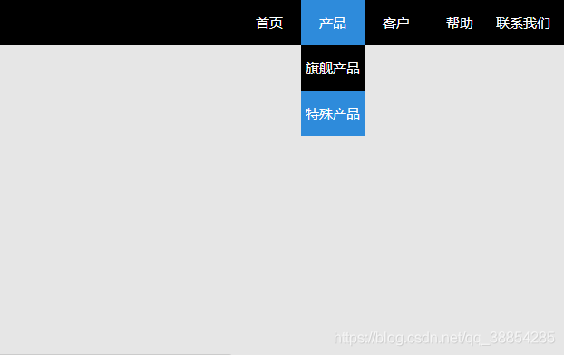

### 源码：

```html
<!DOCTYPE html>
<html>
<meta charset="utf-8">
<head>
	<title>nav</title>
</head>
 
<style type="text/css">

    body,ul,li,a {padding: 0;margin: 0;}
    body {background-color:#e6e6e6;color: #fff;}	
    ul li {float: left;display: inline-block;position: relative;width: 60px;line-height: 50px;padding: 0 5px;cursor: pointer;}
    ul li:hover {background-color:#288add;}
    ul li ul li {float: none;}
    ul li ul {position: absolute;left:0;display: none;}
    ul li ul li:hover {background-color: #288add;}
    ul li:hover ul {display: block;background-color:#000;}
	
    .nav {height: 50px;background-color: #000;}
    .navbar {float:right;margin-right:10px;list-style-type: none;} 
    .navbar a {display: block;height: 50px;font-family: "Microsoft Yahei";font-size: 15px;text-align: center;text-decoration: none;color: #fff;}
 
</style>
 
<body>
<div style="width:100%;height:50px">

<div class="nav">
	<ul class="navbar">
		<li class="" ><a href="">首页</a></li>
		<li class="" ><a href="">产品</a>
		  <ul>
            <li><a href="">旗舰产品</a></li>
            <li><a href="">特殊产品</a></li>
          </ul>
		</li>
		<li class="" ><a href="">客户</a></li>
		<li class="" ><a href="">帮助</a></li>
		<li class="" ><a href="">联系我们</a></li>
	</ul>
</div>
</div>
</body>
</html>
```

### 界面效果:


