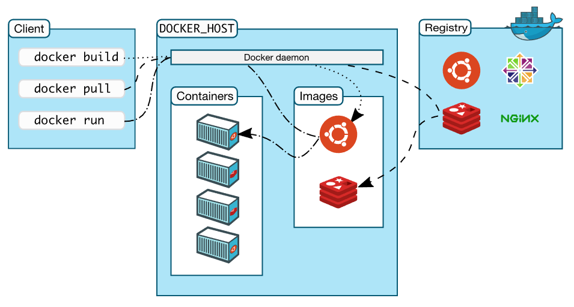

# 1. 概述

Docker是一个开发，交付和运行应用程序的开放平台。 Docker使您可以将应用程序与基础架构分离，以便快速交付软件。 使用Docker，您可以像管理应用程序一样管理基础架构。 通过利用Docker的方法快速发送，测试和部署代码，您可以显着减少编写代码和在生产中运行代码之间的延迟。

## 1.1. 平台（Docker platform）

Docker提供了在称为容器的松散隔离环境中打包和运行应用程序的功能。 隔离和安全性允许您在给定主机上同时运行多个容器。 容器是轻量级的，因为它们不需要管理程序的额外负载，而是直接在主机内核中运行。 这意味着您可以在给定的硬件组合上运行比使用虚拟机时更多的容器。 您甚至可以在实际虚拟机的主机中运行Docker容器！

Docker提供工具和平台来管理容器的生命周期：

  * 使用容器开发应用程序及其支持组件。
  * 容器成为分发和测试应用程序的单元。
  * 准备就绪后，将应用程序部署到生产环境中，作为容器或协调服务。 无论您的生产环境是本地数据中心，云提供商还是两者的混合，这都是相同的。

## 1.2. 引擎 （Docker Engine）

Docker Engine是一个客户端 - 服务器应用程序，包含以下主要组件：

  * 服务器，是一种长时间运行的程序，称为守护程序进程（`dockerd`命令）。
  * 一个REST API，它指定程序可以用来与守护进程通信并指示它做什么的接口。
  * 命令行界面（CLI）客户端（`docker`命令）。


CLI使用Docker REST API通过脚本或CLI命令控制Docker守护程序或与Docker守护程序交互，许多其他Docker应用程序使用底层API和CLI。

守护程序创建和管理Docker对象，例如镜像，容器，网络和卷。

## 1.3. 作用

#### 快速，持续地交付应用程序

Docker允许开发人员使用提供应用程序和服务的本地容器在标准化环境中工作，从而简化了开发生命周期。 容器非常适合持续集成和持续交付（CI / CD）工作流程。

请考虑以下示例场景：

  * 您的开发人员在本地编写代码并使用Docker容器与同事共享他们的工作。
  * 他们使用Docker将他们的应用程序推入测试环境并执行自动和手动测试。
  * 当开发人员发现错误时，他们可以在开发环境中修复它们，并将它们重新部署到测试环境中以进行测试和验证。
  * 测试完成后，获取客户的修复就像将更新的镜像推送到生产环境一样简单。

#### 响应式部署和扩展

Docker基于容器的平台允许高度可移植的工作负载。 Docker容器可以在开发人员的本地笔记本电脑，数据中心的物理或虚拟机，云提供商或混合环境中运行。

Docker的可移植性和轻量级特性还使得可以轻松地动态管理工作负载，按照业务需求即时扩展或拆除应用程序和服务。

#### 在同一硬件上运行更多工作负载

Docker轻巧而快速。 它为基于管理程序的虚拟机提供了一种可行且经济高效的替代方案，因此您可以使用更多的计算容量来实现业务目标。 Docker非常适合高密度环境以及需要用更少资源完成更多工作的中小型部署。

## 1.4. 架构

Docker使用客户端 - 服务器架构。 Docker客户端与Docker守护进程通信，后者负责构建，运行和分发Docker容器。 Docker客户端和守护程序可以在同一系统上运行，也可以将Docker客户端连接到远程Docker守护程序。 Docker客户端和守护程序使用REST API，通过UNIX套接字或网络接口进行通信。



### 1.4.1. 守护进程（Docker Daemon）
Docker守护程序（`dockerd`）侦听Docker API请求并管理Docker对象，如镜像，容器，网络和卷。守护程序还可以与其他守护程序通信以管理Docker服务。

### 1.4.2. 客户端（Docker Client）
Docker客户端（`docker`）是许多Docker用户与Docker交互的主要方式。当您使用诸如`docker run`之类的命令时，客户端会将这些命令发送到`dockerd`，后者将其执行。` docker`命令使用Docker API。 Docker客户端可以与多个守护进程通信。

### 1.4.3. 镜像库（Docker Registry）
Docker镜像库存储Docker镜像。 Docker Hub是任何人都可以使用的公共镜像库，Docker配置为默认在Docker Hub上查找镜像。如果您使用Docker Datacenter（DDC），您甚至可以运行自己的私人镜像库，它包括Docker Trusted Registry（DTR）。

使用`docker pull`或`docker run`命令时，将从配置的镜像库中提取所需的镜像。

使用`docker push`命令时，镜像将被推送到配置的镜像库中。

### 1.4.4. 对象（Docker Objects）
使用Docker时，您正在创建和使用镜像，容器，网络，卷，插件和其他对象。本节简要介绍其中一些对象。

* 镜像（IMAGES）

镜像是一个只读模板，其中包含有关创建Docker容器的说明。 通常，镜像基于另一个镜像，并带有一些额外的自定义。 例如，您可以构建基于`ubuntu`镜像的镜像，以安装Apache Web服务器和应用程序，并配置应用程序运行所需的详细信息。

您可以创建自己的镜像，也可以只使用其他人创建的镜像并在镜像库中发布。 要构建自己的镜像，可以使用简单的语法创建`Dockerfile`，以定义创建镜像和运行镜像所需的步骤。 `Dockerfile`中的每条指令都在镜像中创建一个中间层，更改`Dockerfile`并重建镜像时，仅重建已更改的那些中间层。 与其他虚拟化技术相比，这是使镜像如此轻量，小巧和快速的部分原因。

* 容器 （CONTAINERS）

容器是镜像的可运行实例。 您可以使用Docker API或CLI创建，启动，停止，移动或删除容器。 您可以将容器连接到一个或多个网络，将存储连接到它，甚至可以根据其当前状态创建新镜像。

默认情况下，容器与其他容器及其主机相对隔离。 您可以控制容器的网络，存储或其他基础子系统与其他容器或主机的隔离程度。

容器由其镜像以及您在创建或启动时为其提供的任何配置选项定义。 删除容器后，对其未储存在持久化存储中的任何状态改变都将消失。

`docker run`命令示例：

以下命令运行在ubuntu容器中，以交互方式附加到本地命令行会话，并运行/ bin / bash：

```shell
$ docker run -i -t ubuntu /bin/bash
```

运行此命令时，会发生以下情况（假设您使用的是默认镜像库配置）：

  - 1.如果您在本地没有ubuntu映像，Docker会从您配置的镜像库中提取它，就像您已经手动运行docker pull ubuntu一样。

  - 2.Docker创建了一个新容器，就像您手动运行了docker container create命令一样。

  - 3.Docker将读写文件系统分配给容器，作为其最后一层。这允许正在运行的容器在其本地文件系统中创建或修改文件和目录。

  - 4.Docker创建了一个网络接口，用于将容器连接到默认网络，因为您没有指定任何网络选项。这包括为容器分配IP地址。默认情况下，容器可以使用主机的网络连接连接到外部网络。

  - 5.Docker启动容器并执行/ bin / bash。由于容器以交互方式运行并连接到终端（由于-i和-t标志），因此您可以使用键盘提供输入，同时将输出记录到终端。

  - 6.当您键入exit以终止/ bin / bash命令时，容器会停止但不会被删除。您可以重新启动它或将其删除。

* 服务（SERVICES）

服务允许您跨多个Docker守护程序扩展容器，这些守护程序一起作为具有多个管理器和工作程序的群组一起工作。` swarm`的每个成员都是Docker守护程序，守护进程都使用Docker API进行通信。 服务允许您定义所需的状态，例如在任何给定时间必须可用的服务的副本数。 默认情况下，服务在所有工作节点之间进行负载平衡。 对于消费者来说，Docker服务似乎是一个单独的应用程序。 Docker Engine支持Docker 1.12及更高版本中的`swarm`模式。

## 1.5. 原理

Docker是用Go编写的，它利用Linux内核的几个功能来提供其功能。

### 1.5.1. Namespaces

Docker使用称为`namespaces`的技术来提供称为容器的隔离工作空间。 运行容器时，Docker会为该容器创建一组命名空间。

这些命名空间提供了一层隔离。 容器的每个方面都在一个单独的命名空间中运行，其访问权限仅限于该命名空间。

Docker Engine在Linux上使用以下命名空间：

  - `pid`：进程隔离（PID：进程ID）；
  - `net`：管理网络接口（NET：Networking；
  - `ipc`：管理对IPC资源的访问（IPC：进程间通信）；
  - `mnt`：管理文件系统安装点（MNT：Mount）；
  - `uts`：隔离内核和版本标识符。 （UTS：Unix分时系统）

### 1.5.2. Control groups

Linux上的Docker Engine还依赖于另一种称为`控制组（cgroups）`的技术。 `cgroup`将应用程序限制为特定的资源集。 控制组允许Docker Engine将可用的硬件资源共享给容器，并可选择强制执行限制和约束。 例如，您可以限制特定容器的可用内存。

### 1.5.3. Union file systems

联合文件系统，也叫`UnionFS`，是通过创建层来操作的文件系统，使它们非常轻量和快速。 Docker Engine使用`UnionFS`为容器提供构建块。 Docker Engine可以使用多种`UnionFS`变体，包括AUFS，btrfs，vfs和DeviceMapper。

### 1.5.4. Container format

Docker Engine将`namespaces`，`cgroup`和`UnionFS`组合成一个称为`Container format`的包装器。 默认的容器格式是`libcontainer`。 将来，Docker可以通过与BSD Jails或Solaris Zones等技术集成来支持其他容器格式。
