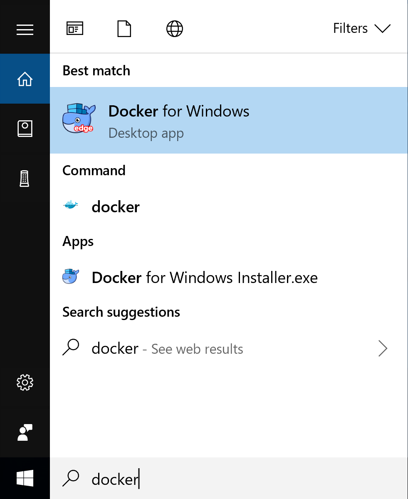
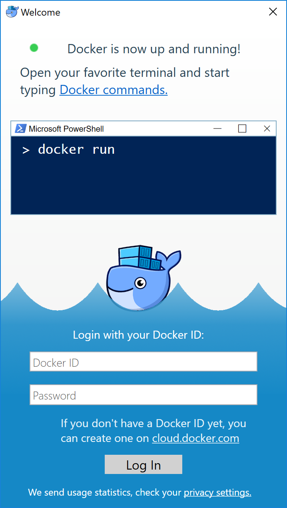

# 2.2 Windows

Docker Desktop for Windows是基于Windows操作系统的[Docker社区版（CE）](https://www.docker.com/community-edition)，访问[ Docker Hub](https://hub.docker.com/editions/community/docker-ce-desktop-windows)下载Docker Desktop for Windows。

## 1. Windows安装前言

**Docker Toolbox和Docker Machine用户必读**：Docker Desktop for Windows需要运行Microsoft Hyper-V。 如果需要，Docker Desktop for Windows安装程序会为您启用Hyper-V，并重新启动计算机。 启用Hyper-V后，VirtualBox不再起作用，但仍保留任何VirtualBox VM映像。 使用`docker-machine`创建的VirtualBox VM（包括通常在Toolbox安装期间创建的默认VM）不再启动。 这些VM不能与Docker Desktop for Windows并排使用。 但是，您仍然可以使用`docker-machine`来管理远程VM。

**系统要求**：

  - Windows 10 x64位：Pro，Enterprise或Education（1607周年更新，Build 14393或更高版本）。
  - 在BIOS中启用虚拟化。 通常，默认情况下启用虚拟化。 这与启用Hyper-V不同。 有关详细信息，请参阅故障排除中[必须启用虚拟化](https://docs.docker.com/docker-for-windows/troubleshoot/#virtualization-must-be-enabled)。
  - 具有CPU SLAT功能。
  - 至少4GB的运行内存。

> 注意：如果您的系统不符合运行Docker Desktop for Windows的要求，则可以安装Docker Toolbox，它使用Oracle Virtual Box而不是Hyper-V。

**Docker Desktop for Windows安装包括**：安装提供Docker Engine，Docker CLI客户端，Docker Compose，Docker Machine和Kitematic。

使用Docker Desktop for Windows创建的容器和映像在安装它的计算机上的所有用户帐户之间共享。 这是因为所有Windows帐户都使用相同的VM来构建和运行容器。

嵌套的虚拟化方案，例如在VMWare或Parallels实例上运行Docker Desktop for Windows可能会有效，但无法保证。 有关更多信息，请参阅[嵌套虚拟化方案中的运行Docker Desktop for Windows](https://docs.docker.com/docker-for-windows/troubleshoot/#running-docker-for-windows-in-nested-virtualization-scenarios)。

> 注意：有关Windows Server的完整Docker兼容性信息，请参阅[Docker兼容性矩阵](https://success.docker.com/article/compatibility-matrix)。

## 2. 安装Desktop for Windows 桌面应用程序

1. 双击`Docker Desktop for Windows Installer.exe`以运行安装程序。

> 如果您尚未下载安装程序（`Docker Desktop Installer.exe`），可以从[download.docker.com](https://download.docker.com/win/stable/Docker%20for%20Windows%20Installer.exe)获取。 它通常会下载到`下载`文件夹，或者您可以从Web浏览器底部的最近下载栏运行它。

2. 按照安装向导接受许可，授权安装程序，然后继续安装。

> 在安装过程中，系统会要求您使用系统密码授权`Docker.app`。 需要特权访问才能安装网络组件，指向Docker应用程序的链接以及管理Hyper-V VM。

3. 在安装完成对话框中单击`完成`以启动Docker。

## 3. 启动Desktop for Windows

安装后Docker不会自动启动。 要启动它，请搜索Docker，在搜索结果中选择Docker Desktop for Windows，然后单击它（或按Enter键）。

当状态栏中的鲸鱼保持稳定时，Docker正在运行，并且可以从任何终端窗口访问。

如果鲸鱼隐藏在通知区域中，请单击任务栏上的向上箭头以显示它。 有关详细信息，请参阅[Docker设置](https://docs.docker.com/docker-for-windows/#docker-settings-dialog)。

如果您刚刚安装了该应用程序，您还会收到一条弹出式成功消息，其中包含建议的后续步骤以及此文档的链接。

初始化完成后，从“通知”区域图标中选择“关于Docker”以验证您是否具有最新版本。

恭喜！ 您已启动并运行Docker Desktop for Windows。
