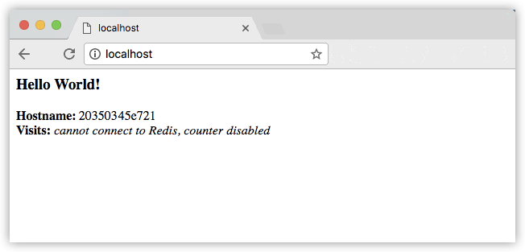

# 3.4 服务

## 1. 先决条件

- [安装 Docker 版本 1.13 或更高版本](https://docs.docker-cn.com/engine/installation/)。
- 获取 [Docker Compose](https://docs.docker-cn.com/compose/overview/)。在 [适用于 Mac 的 Docker](https://docs.docker-cn.com/docker-for-mac/) 及 [适用于 Windows 的 Docker](https://docs.docker-cn.com/docker-for-windows/) 上，它已预先安装，因此您已准备就绪。在 Linux 系统上，您需要[直接安装它](https://github.com/docker/compose/releases)。在 Windows 10 之前的系统上， *如果没有 Hyper-V*，请使用 [Docker Toolbox](https://docs.docker-cn.com/toolbox/overview/)。
- 阅读第一、二节的容器和镜像。
- 确保您已发布通过[将其推送到镜像库](https://docs.docker-cn.com/get-started/part2/#share-your-image)创建的 `friendlyhello` 镜像。我们将在此处使用该共享镜像。
- 确保您的镜像充当已部署的容器。运行以下命令，并填写 `username`、`repo` 和 `tag` 信息：`docker run -p 80:80 username/repo:tag`，然后访问 `http://localhost/`。

## 2. 简介

在第 3 部分中，我们将扩展应用并启用负载均衡。如需完成此操作，我们必须前往分布式应用的层次结构中的上一级别： **服务**。

- 技术栈
- **服务**（您在此处）
- 容器（请参阅[第 2 部分](https://docs.docker-cn.com/get-started/part2/)）

## 3. 了解服务

在分布式应用中，应用的不同部分称为“服务”。例如，假设有一个视频共享网站，它可能提供用于在数据库中存储应用程序数据的服务、用于在用户上传一些内容后在后台进行视频转码的服务、用于前端的服务等。

服务实际上是“生产中的容器”。一项服务仅运行一个镜像，但它会编制镜像的运行方式 - 它应使用的端口、容器的多少个从节点应运行才能使服务的容量满足其需求等。扩展服务将更改运行该软件的容器实例数，并将多个计算资源分配给进程中的服务。

幸运的是，很容易使用 Docker 平台定义、运行和扩展服务 – 只需编写一个 `docker-compose.yml` 文件即可。

## 4. 您的第一个 `docker-compose.yml` 文件

`docker-compose.yml` 文件是一个 `YAML` 文件，用于定义 Docker 容器在生产中的行为方式。

#### `docker-compose.yml`

需要时，将此文件另存为 `docker-compose.yml`。确保您已[推送镜像](https://docs.docker-cn.com/get-started/part2/#share-your-image)（在[第 2 部分](https://docs.docker-cn.com/get-started/part2/)中创建）至镜像库，并通过将`username/repo:tag` 替换为镜像详细信息来更新此 `.yml`。

```
version:"3"
services:
  web:
    # 将 username/repo:tag 替换为您的名称和镜像详细信息
    image: username/repository:tag
    deploy:
      replicas:5
      resources:
        limits:
          cpus:"0.1"
          memory:50M
      restart_policy:
        condition: on-failure
    ports:
      - "80:80"
    networks:
      - webnet
networks:
  webnet:
```

此 `docker-compose.yml` 文件会告诉 Docker 执行以下操作：

- 从镜像库中拉取[我们在步骤 2 中上传的镜像](http://172.22.3.3/Hakugei/docker/blob/master/3-GetStart.md#%E5%8F%91%E5%B8%83%E9%95%9C%E5%83%8F)。
- 将该镜像的五个实例作为服务 `web` 运行，并将每个实例限制为最多使用 10% 的 CPU（在所有核心中）以及 50MB RAM。
- 如果某个容器发生故障，立即重启容器。
- 将主机上的端口 80 映射到 `web` 的端口 80。
- 指示 `web` 容器通过负载均衡的网络 `webnet` 共享端口 80。（在内部，容器自身将在临时端口发布到 `web` 的端口 80。）
- 使用默认设置定义 `webnet` 网络（此为负载均衡的 overlay 网络）。

> #### 想了解关于 Compose 文件版本、名称和命令的信息？
>
> 请注意，将 Compose 文件设置为 `version:"3"`。本质上，这会使其兼容 [swarm mode](https://docs.docker-cn.com/engine/swarm/)。我们可以使用 [deploy key](https://docs.docker-cn.com/compose/compose-file/#deploy)（仅可用于 [Compose 文件格式版本 3.x](https://docs.docker-cn.com/compose/compose-file/) 及更高版本）及其子选项对每项服务（例如，`web`）进行负载均衡和优化性能。我们可以使用 `docker stack deploy` 命令（仅在 Compose 文件版本 3.x 及更高版本上受支持）运行此文件。您可以使用 `docker-compose up` 运行具有_非 swarm_ 配置的版本 3 文件，但由于我们将构建 swarm 示例，因此会专注于技术栈部署。
>
> 您可以将 Compose 文件命名为任何所需内容，以使其在逻辑上具有意义；`docker-compose.yml` 仅为标准名称。我们可以简单地将此文件命名为 `docker-stack.yml` 或更特定于项目的内容。

## 5. 运行新的负载均衡的应用

需要先运行以下命令，然后才能使用 `docker stack deploy` 命令：

```
docker swarm init

```

> **注意**：我们将在[第 4 部分](https://docs.docker-cn.com/get-started/part4/)中了解该命令的含义。 如果未运行 `docker swarm init`，您将收到错误消息“此节点不是 swarm 管理节点”。

现在，运行此命令。您必须为应用指定一个名称。在此处该名称设置为 `getstartedlab`：

```
docker stack deploy -c docker-compose.yml getstartedlab

```

我们已经在一台主机上运行部署映像的5个容器实例。我们来看一下吧。

在我们的应用程序中获取一项服务的服务ID：

```
docker service ls

```

请观察输出的`web`服务，并以您的应用名称为前缀。如果您将其命名为与此示例中显示的相同，则名称为 `getstartedlab_web`。还列出了服务ID，以及副本数，映像名称和公开端口。

或者，您可以运行`docker stack services`，然后运行技术栈的名称。以下示例命令允许您查看与`getstartedlab`技术栈关联的所有服务 ：

```shell
docker stack services getstartedlab
ID      NAME          MODE                REPLICAS            IMAGE               PORTS
bqpve1djnk0x  getstartedlab_web  replicated    5/5   username/repo:tag  *:4000->80/tcp
```

在服务中运行的单个容器称为**任务**。任务被赋予以数字递增的唯一ID，最多为您创建在`docker-compose.yml`中定义的数量的`副本`。使用下面的命令为您列出您的服务任务：

```
docker service ps getstartedlab_web

```

如果您只列出系统上的所有容器，则任务也会显示，但不会被服务过滤：

```
docker container ls -q

```

您可以`curl -4 http://localhost:4000`连续多次运行，或者在浏览器中转到该URL并点击刷新几次。



无论哪种方式，容器ID都会发生变化，从而证明实现了负载均衡; 对于每个请求，以循环方式选择5个任务中的一个来响应。容器ID与上一个命令（`docker container ls -q`）的输出匹配。

要查看技术栈的所有任务，您可以运行`docker stack ps`您的应用程序名称，如以下示例所示：

```shell
docker stack ps getstartedlab
ID      NAME    IMAGE    NODE     DESIRED STATE   CURRENT STATE   ERROR       PORTS
uwiaw67sc0eh        getstartedlab_web.1   username/repo:tag   docker-desktop      Running             Running 9 minutes ago                       
sk50xbhmcae7        getstartedlab_web.2   username/repo:tag   docker-desktop      Running             Running 9 minutes ago                       
c4uuw5i6h02j        getstartedlab_web.3   username/repo:tag   docker-desktop      Running             Running 9 minutes ago                       
0dyb70ixu25s        getstartedlab_web.4   username/repo:tag   docker-desktop      Running             Running 9 minutes ago                       
aocrb88ap8b0        getstartedlab_web.5   username/repo:tag   docker-desktop      Running             Running 9 minutes ago
```

> #### 运行Windows 10？
>
> Windows 10 PowerShell应该已经可以使用`curl`命令，但如果没有，你可以使用像[Git BASH](https://git-for-windows.github.io/)这样的Linux终端模拟器 ，或者下载 [与Windows](http://gnuwin32.sourceforge.net/packages/wget.htm) 非常相似的[wget](http://gnuwin32.sourceforge.net/packages/wget.htm)。

> 响应时间慢？
>
> 根据您环境的网络配置，容器最多可能需要30秒才能响应HTTP请求。这并不表示Docker或swarm性能，而是我们在本教程后面讨论的未满足的`Redis`依赖性。目前，访客柜台因同样的原因不起作用; 我们还没有添加服务来保存数据

## 6. 扩展应用程序

您可以通过更改`docker-compose.yml`中`replicas`的值，保存更改并重新运行`docker stack deploy`命令来扩展应用程序：

```
docker stack deploy -c docker-compose.yml getstartedlab
```

Docker 将执行原地更新，而无需先清除技术栈或终止任何容器。

现在，重新运行 `docker stack ps` 命令以查看经过重新配置的已部署实例。例如，如果您扩展了从节点，将有更多处于运行状态的容器。

## 7. 清除应用和 swarm

- 使用 `docker stack rm` 清除应用：

```
docker stack rm getstartedlab
```

- 清除 swarm。

```
docker swarm leave --force
```

这与使用 Docker 启动并扩展应用一样简单。您已朝向了解如何在生产中运行容器前进了一大步。下面您将了解如何在 Docker 机器集群上将此应用作为真正的 swarm 运行。

> **注意**：类似于此文件的 Compose 文件用于使用 Docker 定义应用程序，并且可以使用 [Docker 云](https://docs.docker-cn.com/docker-cloud/)上传到云提供商，或者可以使用 [Docker 企业版](https://www.docker.com/enterprise-edition)上传到您选择的任何硬件或云提供商。

可以在此阶段探索的一些命令：

```shell
docker stack ls                  # 列出此 Docker 主机上所有正在运行的应用
docker stack deploy -c <composefile> <appname>  # 运行指定的 Compose 文件
docker service ls                 # 列出与应用关联的服务
docker service ps <service>                  # 列出与应用关联的正在运行的容器
docker inspect <task or container>                   # 检查任务或容器
docker container ls -q                                      # 列出容器的IDs
docker stack rm <appname>                             # 清除应用
docker swarm leave --force      # 从管理器中清除单个节点群                   

```