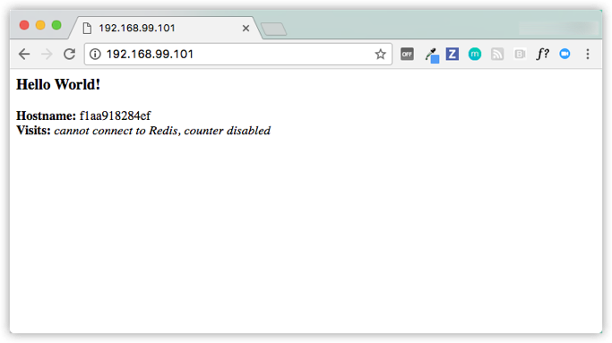

# 3.5 集群

## 1. 先决条件

- [安装 Docker 版本 1.13 或更高版本](https://docs.docker-cn.com/engine/installation/)。
- 按照[第 3 部分：先决条件](https://docs.docker-cn.com/get-started/part3/#prerequisites)中所述，获取 [Docker Compose](https://docs.docker-cn.com/compose/overview/)。
- 获取 [Docker Machine](https://docs.docker-cn.com/machine/overview/)，它使用[适用于 Mac 的 Docker](https://docs.docker-cn.com/docker-for-mac/) 和 [适用于 Windows 的 Docker](https://docs.docker-cn.com/docker-for-windows/) 预先安装，但在 Linux 系统上，您需要[直接安装它](https://docs.docker-cn.com/machine/install-machine/#installing-machine-directly)。在 Windows 10 之前的系统上，*如果没有 Hyper-V*，请使用 [Docker Toolbox](https://docs.docker-cn.com/toolbox/overview/)。
- 阅读第一、二节的容器和镜像。
- 确保您已发布通过[将其推送到镜像库](https://docs.docker-cn.com/get-started/part2/#share-your-image)创建的 `friendlyhello` 镜像。我们将在此处使用该共享镜像。
- 确保您的镜像充当已部署的容器。运行以下命令，并填写 `username`、`repo` 和 `tag` 信息：`docker run -p 80:80 username/repo:tag`，然后访问 `http://localhost/`。
- 就近从[第 3 部分](https://docs.docker-cn.com/get-started/part3/)获取 `docker-compose.yml` 的副本。

## 2. 简介

在[第 3 部分](https://docs.docker-cn.com/get-started/part3/)中，您使用了在[第 2 部分](https://docs.docker-cn.com/get-started/part2/)中编写的应用，并通过将其转换为服务以及在进程中将其最多扩展 5 倍来定义了它应如何在生产中运行。

在第 4 部分中，您可以在此处将此应用部署到集群，并在多台机器上运行它。可以通过将多台机器加入`Dockerized`集群 **swarm**来实现多容器、多机器应用。

## 3. 了解 swarm 集群

swarm 是一组运行 Docker 并且已加入集群中的机器。执行此操作后，您可以继续运行已使用的 Docker 命令，但现在它们在集群上由 **swarm 管理节点**执行。 swarm 中的机器可以为物理或虚拟机。加入 swarm 后，可以将它们称为**节点**。

swarm 管理节点可以使用多项策略来运行容器，例如“最空的节点”– 这将使用容器填充使用最少的机器。或“全局”，这将确保每台机器恰好获得指定容器的一个实例。您可以指示 swarm 管理节点使用 Compose 文件中的这些策略，就像您已使用的策略一样。

swarm 管理节点是 swarm 中可以执行命令或授权其他机器加入 swarm 作为**工作节点**的唯一机器。工作节点仅用于提供功能，并且无权告知任何其他机器它可以做什么和不能做什么。

到目前为止，您已在本地机器上以单主机模式使用 Docker。但是，也可以将 Docker 切换到 **swarm mode**，并且这可以实现 swarm 的使用。即时启用 swarm mode 可以使当前机器成为 swarm 管理节点。从那时起，Docker 将在您要管理的 swarm 上运行您执行的命令，而不是仅在当前机器上执行命令。

### 3.1. 创建一个集群

swarm 由多个节点组成，这些节点可以是物理或虚拟机。基本概念非常简单：运行 `docker swarm init` 以启用 swarm mode 并使当前机器成为 swarm 管理节点，然后在其他机器上运行 `docker swarm join`，使它们以工作节点形式加入 swarm。选择下面的选项卡以查看如何在各种上下文中执行此操作。我们将使用 VM 来快速创建包含两台机器的集群并将其转换为 swarm。

#### 3.1.1. 本地 `VM`（Mac、Linux、Windows 7 和 8）

首先，您将需要可以创建 VM 的管理程序，因此针对机器的操作系统[安装 VirtualBox](https://www.virtualbox.org/wiki/Downloads)。

> **注意**：如果您在已安装 Hyper-V 的 Windows 系统中， Windows 10 无需安装 VirtualBox 并且您应该改为使用 Hyper-V 。通过单击上述 Hyper-V 选项卡，查看用于 Hyper-V 系统系统的说明。

现在，使用 `docker-machine` 和 VirtualBox 驱动来创建一对 VM：

```none
$ docker-machine create --driver virtualbox myvm1
$ docker-machine create --driver virtualbox myvm2
```

#### 3.1.2. 列出虚拟机并获取其`IP`地址

现在，您已创建两个` VM`，分别名为 `myvm1` 和 `myvm2`（如 `docker-machine ls` 所示）。

使用此命令列出计算机并获取其IP地址。

> **注意**：您需要以管理员身份运行以下命令，否则您将无法获得任何合理的输出（仅“未知”）。

```
docker-machine ls

```

以下是此命令的示例输出。

```
$ docker-machine ls
NAME    ACTIVE   DRIVER       STATE     URL                         SWARM   DOCKER        ERRORS
myvm1   -        virtualbox   Running   tcp://192.168.99.100:2376           v17.06.2-ce
myvm2   -        virtualbox   Running   tcp://192.168.99.101:2376           v17.06.2-ce

```

#### 3.1.3. 初始化SWARM并添加节点

第一个 `VM`将用作管理节点，用于执行 `docker` 命令并对加入 swarm 的工作节点进行身份验证，而第二个 `VM` 将为工作节点。

您可以使用 `docker-machine ssh` 向 VM 发送命令。使用 `docker swarm init` 指示 `myvm1` 成为 swarm 管理节点，并且您将看到类似于以下内容的输出：

```shell
$ docker-machine ssh myvm1 "docker swarm init"
Swarm initialized: current node <node ID> is now a manager.

To add a worker to this swarm, run the following command:

  docker swarm join \
  --token <token> \
  <ip>:<port>
  To add a manager to this swarm, run 'docker swarm join-token manager' and follow the instructions.
```

> #### 端口2377和2376
>
> `docker swarm init`和`docker swarm join`始终运行使用端口2377（群集管理端口），或着根本没有指定端口，并使其采用默认值。
>
> `docker-machine ls`包含端口2376 返回的计算机`IP`地址，即Docker守护程序端口。请勿使用此端口，否则 [您可能会遇到错误](https://forums.docker.com/t/docker-swarm-join-with-virtualbox-connection-error-13-bad-certificate/31392/2)。

> 使用SSH时遇到问题？试试--native-ssh标志
>
> Docker Machine [可以让您使用自己系统的SSH](https://docs.docker.com/machine/reference/ssh/#different-types-of-ssh)，如果由于某种原因您无法向Swarm管理器发送命令。只需`--native-ssh`在调用`ssh`命令时指定 标志：

` docker-machine --native-ssh ssh myvm1 ... `

如您所见，对 `docker swarm init` 的响应包含预先配置的 `docker swarm join` 命令，以便您在任何要添加的节点上运行。复制此命令，然后通过 `docker-machine ssh` 将其发送给 `myvm2`，从而让 `myvm2` 加入您的新 swarm 作为工作节点。

```shell
$ docker-machine ssh myvm2 "docker swarm join --token <token> <ip>:<port>"
This node joined a swarm as a worker.

```

#### 祝贺您，已成功创建您的第一个 swarm。

> **注意**：您还可以在没有附加任何命令的情况运行 `docker-machine ssh myvm2`，以便在该 VM 上打开终端会话。在您已准备好返回到主机 shell 提示符时，请输入 `exit`。可能更容易通过这种方式粘贴 join 命令。

使用 `ssh` 连接到 (`docker-machine ssh myvm1`)，并运行 `docker node ls` 以查看此 swarm 中的节点：

```
docker@myvm1:~$ docker node ls
ID         HOSTNAME           STATUS         AVAILABILITY       MANAGER   STATUS
brtu9urxwfd5j0zrmkubhpkbd     myvm2            Ready            Active              
rihwohkh3ph38fhillhhb84sk *   myvm1            Ready            Active    Leader
```

> #### 离开**swarm**
>
> 如果要重新开始，可以运行`docker swarm leave`命令令每个节点重新运行。

#### 3.2.1.  本地 `VM` (Windows 10/Hyper-V)

首先，快速为您要共享的 VM 创建虚拟交换机，因此它们将能够彼此相互连接。

1. 启动 Hyper-V 管理节点
2. 单击右侧菜单中的**虚拟交换机管理节点**
3. 单击类型为**外部**的**创建虚拟交换机**
4. 为其指定名称 `myswitch`，然后选中此框以共享主机的活动网络适配器

现在，使用节点管理工具 `docker-machine` 创建一对虚拟机：

> **注意**：您需要以管理员身份运行以下命令，否则您无权创建`hyperv VM`！

```shell
$ docker-machine create -d hyperv --hyperv-virtual-switch "myswitch" myvm1
$ docker-machine create -d hyperv --hyperv-virtual-switch "myswitch" myvm2
```

#### 3.2.2. 列出虚拟机并获取其IP地址

您现在创建了两个名为`myvm1`和的VM `myvm2`。

使用此命令列出计算机并获取其IP地址。

> **注意**：您需要以管理员身份运行以下命令，否则您将无法获得任何合理的输出（仅“未知”）。

```
docker-machine ls
```

以下是此命令的示例输出。

```shell
$ docker-machine ls
NAME   ACTIVE  DRIVER       STATE     URL     SWARM         DOCKER               ERRORS
myvm1   -     virtualbox  Running  tcp://192.168.99.100:2376   17.06.2-ce
myvm2   -     virtualbox  Running  tcp://192.168.99.101:2376   v17.06.2-c
```

#### 3.2.3. 初始化SWARM并添加节点

现在，您已创建两个 `VM`，分别名为 `myvm1` 和 `myvm2`（如 `docker-machine ls` 所示）。第一个 `VM` 将用作管理节点，用于执行 `docker` 命令并对加入 swarm 的工作节点进行身份验证，而第二个` VM `将为工作节点。

您可以使用 `docker-machine ssh` 向 VM 发送命令。使用 `docker swarm init` 指示 `myvm1` 成为 swarm 管理节点，并且您将看到类似于以下内容的输出：

```
$ docker-machine ssh myvm1 "docker swarm init"
Swarm initialized: current node <node ID> is now a manager.

To add a worker to this swarm, run the following command:

  docker swarm join --token <token> <ip>:<port>
  To add a manager to this swarm, run 'docker swarm join-token manager' and follow the instructions.
```

> #### 收到关于需要使用 `--advertise-addr` 的错误？
>
> 通过运行 `docker-machine ls` 来复制 `myvm1` 的 IP 地址，然后使用 该 IP 地址并通过 `--advertise-addr` 指定端口 `2377`（用于 swarm join 的端口）， 以便再次运行 `docker swarm init` 命令。例如：
>
> docker-machine ssh myvm1 "docker swarm init --advertise-addr 192.168.99.100:2377"

如您所见，对 `docker swarm init` 的响应包含预先配置的 `docker swarm join` 命令，以便您在任何要添加的节点上运行。复制此命令，然后通过 `docker-machine ssh` 将其发送给 `myvm2`，从而让 `myvm2` 加入您的新 swarm 作为工作节点。

```
$ docker-machine ssh myvm2 "docker swarm join \
--token <token> \
<ip>:<port>"

This node joined a swarm as a worker.

```

祝贺您，已成功创建您的第一个 swarm。

> **注意**：您还可以在没有附加任何命令的情况运行 `docker-machine ssh myvm2`，以便在该 VM 上打开终端会话。在您已准备好返回到主机 shell 提示符时，请输入 `exit`。可能更容易通过这种方式粘贴 join 命令。

使用 `ssh` 连接到 (`docker-machine ssh myvm1`)，并运行 `docker node ls` 以查看此 swarm 中的节点：

```
docker@myvm1:~$ docker node ls
ID         HOSTNAME           STATUS         AVAILABILITY       MANAGER   STATUS
brtu9urxwfd5j0zrmkubhpkbd     myvm2            Ready            Active              
rihwohkh3ph38fhillhhb84sk *   myvm1            Ready            Active    Leader

```

> #### 离开**swarm**
>
> 如果要重新开始，可以运行`docker swarm leave`命令令每个节点重新运行。

## 4. 在集群上部署应用

困难的部分已完成。现在，您只需重复在[第 3 部分](https://docs.docker-cn.com/get-started/part3/)中使用的进程，以便在新 swarm 中进行部署。只需记住，只有 `myvm1` 之类的 swarm 管理节点执行 Docker 命令；工作节点仅适用于容量。

### 4.1. `docker-machine`为swarm管理器配置shell

到目前为止，您已经将Docker命令包装在`docker-machine ssh`与VM通信中。另一种选择是运行`docker-machine env <machine>`以获取并运行一个命令，该命令将当前shell配置为与VM上的Docker守护程序通信。此方法适用于下一步，因为它允许您使用本地`docker-compose.yml`文件“远程”部署应用程序，而无需将其复制到任何位置。

输入`docker-machine env myvm1`，命令，然后复制粘贴并运行作为输出的最后一行提供的命令，以配置要与之通信的shell（`myvm1`swarm管理器）。

配置shell的命令在Mac，Linux与Windows有些不同，因此每个示例都显示在下面的选项卡上

#### MAC或LINUX上的DOCKER机器SHELL环境

运行`docker-machine env myvm1`以获取命令以配置要与之通信的shell `myvm1`。

```
$ docker-machine env myvm1
export DOCKER_TLS_VERIFY="1"
export DOCKER_HOST="tcp://192.168.99.100:2376"
export DOCKER_CERT_PATH="/Users/sam/.docker/machine/machines/myvm1"
export DOCKER_MACHINE_NAME="myvm1"
# Run this command to configure your shell:
# eval $(docker-machine env myvm1)
```

运行给定命令以配置要与之通信的shell `myvm1`。

```
eval $(docker-machine env myvm1)
```

运行`docker-machine ls`以验证它`myvm1`现在是活动计算机，如旁边的星号所示。

```shell
$ docker-machine ls
NAME    ACTIVE   DRIVER       STATE     URL                         SWARM   DOCKER        ERRORS
myvm1   *        virtualbox   Running   tcp://192.168.99.100:2376           v17.06.2-ce
myvm2   -        virtualbox   Running   tcp://192.168.99.101:2376           v17.06.2-ce
```

#### WINDOWS上的DOCKER机器SHELL环境

运行`docker-machine env myvm1`以获取命令以配置要与之通信的shell `myvm1`。

```
PS C:\Users\sam\sandbox\get-started> docker-machine env myvm1
$Env:DOCKER_TLS_VERIFY = "1"
$Env:DOCKER_HOST = "tcp://192.168.203.207:2376"
$Env:DOCKER_CERT_PATH = "C:\Users\sam\.docker\machine\machines\myvm1"
$Env:DOCKER_MACHINE_NAME = "myvm1"
$Env:COMPOSE_CONVERT_WINDOWS_PATHS = "true"
# Run this command to configure your shell:
# & "C:\Program Files\Docker\Docker\Resources\bin\docker-machine.exe" env myvm1 | Invoke-Expression
```

运行给定命令以配置要与之通信的shell `myvm1`。

```
& "C:\Program Files\Docker\Docker\Resources\bin\docker-machine.exe" env myvm1 | Invoke-Expression
```

运行`docker-machine ls`以验证它`myvm1`是旁边的星号所指示的活动计算机。

```
PS C:PATH> docker-machine ls
NAME    ACTIVE   DRIVER   STATE     URL                          SWARM   DOCKER        ERRORS
myvm1   *        hyperv   Running   tcp://192.168.203.207:2376           v17.06.2-ce
myvm2   -        hyperv   Running   tcp://192.168.200.181:2376           v17.06.2-ce
```

## 5. 在swarm管理器上部署应用程序

现在你拥有了`myvm1`，您可以使用其作为群组管理器的功能，通过使用`docker stack deploy`您在第3部分中使用的相同命令`myvm1`和您的本地副本来部署您的应用程序`docker-compose.yml.`。此命令可能需要几秒钟才能完成，部署需要一些时间才能完成。使用`docker service ps <service_name>`swarm管理器上的 命令验证是否已重新部署所有服务。

您的`myvm1`通过`docker-machine`shell配置进行连接，您仍然可以访问本地主机上的文件。确保您与以前位于同一目录中，其中包括`docker-compose.yml`您在第3部分中创建的 [文件](http://172.22.3.3/Hakugei/docker/blob/master/3-GetStart.md#4%E6%82%A8%E7%9A%84%E7%AC%AC%E4%B8%80%E4%B8%AA-docker-composeyml-%E6%96%87%E4%BB%B6)。

与以前一样，运行以下命令以部署应用程序`myvm1`。

```
docker stack deploy -c docker-compose.yml getstartedlab
```

就是这样，应用程序部署在一个群集集群中！

**注意**：如果您的映像存储在私有仓库而不是Docker Hub上，则需要使用登录`docker login <your-registry>`，然后需要将`--with-registry-auth`标志添加到上述命令中。例如：

```
docker login registry.example.com

docker stack deploy --with-registry-auth -c docker-compose.yml getstartedlab
```

这会使用加密的`WAL`日志将登录令牌从本地客户端传递到部署服务的swarm节点。有了这些信息，节点就可以登录仓库并提取镜像。

现在，您可以使用第[3部分中](https://docs.docker.com/get-started/part3/#run-your-new-load-balanced-app)使用的相同[docker命令](https://docs.docker.com/get-started/part3/#run-your-new-load-balanced-app)。并且它们全部将按您的预期工作。只有这一次，您会看到容器已分布在 `myvm1` 和 `myvm2` 之间。

```shell
$ docker-machine ssh myvm1 "docker stack ps getstartedlab"

ID            NAME        IMAGE              NODE   DESIRED STATE
jq2g3qp8nzwx  test_web.1  username/repo:tag  myvm1  Running
88wgshobzoxl  test_web.2  username/repo:tag  myvm2  Running
vbb1qbkb0o2z  test_web.3  username/repo:tag  myvm2  Running
ghii74p9budx  test_web.4  username/repo:tag  myvm1  Running
0prmarhavs87  test_web.5  username/repo:tag  myvm2  Running
```

您可以从 `myvm1` **或** `myvm2` 的 `IP` 地址访问应用。您创建的网络将在它们之间共享并实现了负载均衡。运行`docker-machine ls` 以获取` VM`的` IP` 地址，并在浏览器上访问其中一个地址，并按“刷新”（或者仅对它们执行 `curl`）。您将看到五个可能的容器 ID 全部随机循环，表示负载均衡。



这两个 `IP` 地址都适用的原因在于，swarm 中的节点将参加入口**网格路由**。这可以确保 swarm 中特定端口上部署的服务始终将该端口保留给它自己，而与实际运行容器的是什么节点无关。下面显示了在三节点 swarm 上的端口 `8080` 发布的服务 `my-web` 的网格路由的图：


> #### 遇到连接问题？
>
> 请记住，为了使用 swarm 中的入口网络， 您需要在 swarm 节点之间开放以下端口， 然后再启用 swarm mode：
>
> - 端口 7946 TCP/UDP，用于容器网络发现。
> - 端口 4789 `UDP`，用于容器入口网络。

## 6. 迭代和扩展应用

您可以在此处执行在“第 3 部分”中学习的所有内容。

通过更改 `docker-compose.yml` 文件扩展应用。

通过编辑代码更改应用行为。

无论哪种情况，只需再次运行 `docker stack deploy` 即可部署这些更改。

通过使用对 `myvm2` 使用的 `docker swarm join` 命令，您可以将任何机器（物理或虚拟）加入此 swarm，并且容量将添加到集群中。然后，运行 `docker stack deploy`，应用便可以利用新资源。

## 7. 清理

您可以使用 `docker stack rm` 清除技术栈。例如：

```
docker-machine ssh myvm1 "docker stack rm getstartedlab"

```

> #### 保留 swarm 还是将其删除？
>
> 在稍后的某个时间，您可以在需要时使用 工作节点上的 `docker-machine ssh myvm2 "docker swarm leave"` 和管理节点上的 `docker-machine ssh myvm1 "docker swarm leave --force"` 删除此 swarm，但_由于您将需要在第 5 部分中使用此 swarm，因此请 暂时将其保留_。

### 7.1. 取消设置docker-machine shell变量设置

您可以`docker-machine`使用给定命令在当前shell中取消设置环境变量。

在**Mac或Linux上**，命令是：

```
  eval $(docker-machine env -u)

```

在**Windows上**，命令是：

```
  & "C:\Program Files\Docker\Docker\Resources\bin\docker-machine.exe" env -u | Invoke-Expression

```

这会使shell与`docker-machine`创建的虚拟机断开连接，并允许您继续在同一个shell中工作，现在使用本机`docker` 命令（例如，在Docker Desktop for Mac或Docker Desktop for Windows上）。要了解更多信息，请参阅[有关取消设置环境变量](https://docs.docker.com/machine/get-started/#unset-environment-variables-in-the-current-shell)的[计算机主题](https://docs.docker.com/machine/get-started/#unset-environment-variables-in-the-current-shell)。

### 7.2. 重启Docker机器

如果关闭本地主机，Docker计算机将停止运行。您可以通过运行来检查机器的状态`docker-machine ls`。

```
$ docker-machine ls
NAME    ACTIVE   DRIVER       STATE     URL   SWARM   DOCKER    ERRORS
myvm1   -        virtualbox   Stopped                 Unknown
myvm2   -        virtualbox   Stopped                 Unknown

```

要重新启动已停止的计算机，请运行：

```
docker-machine start <machine-name>

```

例如：

```shell
$ docker-machine start myvm1
Starting "myvm1"...
(myvm1) Check network to re-create if needed...
(myvm1) Waiting for an IP...
Machine "myvm1" was started.
Waiting for SSH to be available...
Detecting the provisioner...
Started machines may have new IP addresses. You may need to re-run the `docker-machine env` command.

$ docker-machine start myvm2
Starting "myvm2"...
(myvm2) Check network to re-create if needed...
(myvm2) Waiting for an IP...
Machine "myvm2" was started.
Waiting for SSH to be available...
Detecting the provisioner...
Started machines may have new IP addresses. You may need to re-run the `docker-machine env` command.
```

在第 4 部分中，您已了解 swarm 是什么、swarm 中的节点如何成为管理节点或工作节点、如何创建 swarm 以及如何在其上应用。可以看到，核心 Docker 命令与第 3 部分相同，但它们必须以在 swarm master 上运行为目标。还可以了解到 Docker 网络在运行中的功能，即使容器在不同的机器上运行，此功能也可以在容器之间保持负载均衡请求。最后，您已了解如何在集群上迭代和扩展应用。

以下是与 swarm 进行交互时您可能会运行的命令：

```shell
docker-machine create --driver virtualbox myvm1 # 创建 VM（Mac、Win7、Linux）
docker-machine create -d hyperv --hyperv-virtual-switch "myswitch" myvm1 # Win10
docker-machine env myvm1                # 查看有关节点的基本信息
docker-machine ssh myvm1 "docker node ls"         # 列出 swarm 中的节点
docker-machine ssh myvm1 "docker node inspect <node ID>"        # 检查节点
docker-machine ssh myvm1 "docker swarm join-token -q worker"   # 查看加入令牌
docker-machine ssh myvm1   # 打开与 VM 的 SSH 会话；输入“exit”以结束会话
docker-machine ssh myvm2 "docker swarm leave"  # 使工作节点退出 swarm
docker-machine ssh myvm1 "docker swarm leave -f" # 使主节点退出，终止 swarm
docker-machine start myvm1            # 启动当前未运行的 VM
docker-machine stop $(docker-machine ls -q)               # 停止所有正在运行的 VM
docker-machine rm $(docker-machine ls -q) # 删除所有 VM 及其磁盘镜像
docker-machine scp docker-compose.yml myvm1:~     # 将文件复制到节点的主目录
docker-machine ssh myvm1 "docker stack deploy -c <file> <app>"   # 部署应用
docker node ls                # View nodes in swarm (while logged on to manager)
docker-machine ls # list VMs, asterisk shows which VM this shell is talking to
docker-machine env myvm1      # show environment variables and command for myvm1
eval $(docker-machine env myvm1)         # Mac command to connect shell to myvm1
& "C:\Program Files\Docker\Docker\Resources\bin\docker-machine.exe" env myvm1 | Invoke-Expression   # Windows command to connect shell to myvm1
docker stack deploy -c <file> <app>  # Deploy an app; command shell must be set to talk to manager (myvm1), uses local Compose file
docker-machine scp docker-compose.yml myvm1:~ # Copy file to node's home dir (only required if you use ssh to connect to manager and deploy the app)
eval $(docker-machine env -u)     # Disconnect shell from VMs, use native docker
```