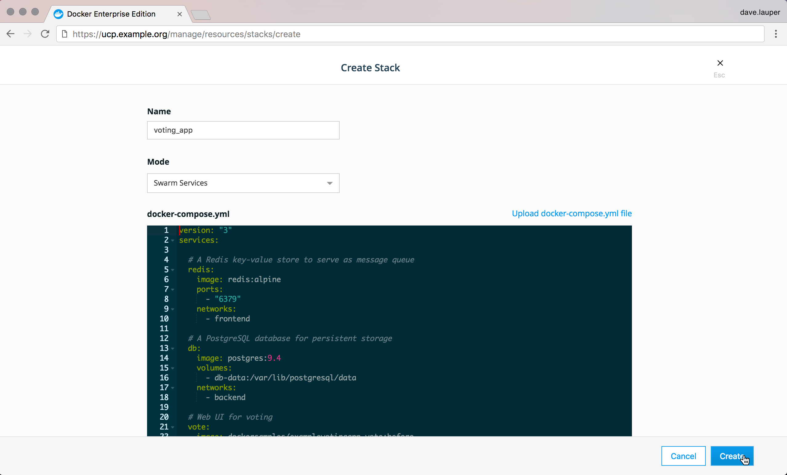
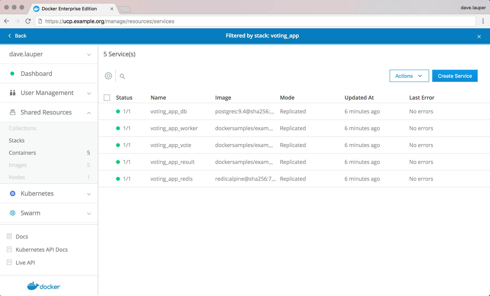

# 3.7 部署应用

## 1. 先决条件

- [安装 Docker 版本 1.13 或更高版本](https://docs.docker-cn.com/engine/installation/)。
- 按照[第 3 部分：先决条件](https://docs.docker-cn.com/get-started/part3/#prerequisites)中所述，获取 [Docker Compose](https://docs.docker-cn.com/compose/overview/)。
- 按照[第 4 部分：先决条件](https://docs.docker-cn.com/get-started/part4/#prerequisites)中所述，获取 [Docker Machine](https://docs.docker-cn.com/machine/overview/)。
- 阅读[第 1 部分](https://docs.docker-cn.com/get-started/)中的新用户导引。
- 在[第 2 部分](https://docs.docker-cn.com/get-started/part2/)中了解如何创建容器。
- 确保您已发布通过[将其推送到镜像库](https://docs.docker-cn.com/get-started/part2/#share-your-image)创建的 `friendlyhello` 镜像。我们将在此处使用该共享镜像。
- 确保您的镜像充当已部署的容器。运行以下命令，并填写 `username`、`repo` 和 `tag` 信息：`docker run -p 80:80 username/repo:tag`，然后访问 `http://localhost/`。
- 就近获取[第 5 部分中最终版本的 `docker-compose.yml`](https://docs.docker-cn.com/get-started/part5/#persist-the-data)。

## 2. 简介

在整个教程中，您一直在编辑同一 Compose 文件。好消息是，和在您的机器上一样，该 Compose 文件在生产中正常运行。我们将在此完成用于运行 Docker 化应用程序的一些选项。

### 2.1. 选择选项

#### 1.Docker Enterprise

Docker 企业版的客户运行 Docker 引擎的稳定商业支持版本，并且作为附加内容，他们将获得我们的一流管理软件` Docker Datacenter`。您可以通过` UI `使用 Universal Control Plane 管理应用的各个方面，使用 Docker Trusted Registry 运行专用镜像库，与 `LDAP `提供商进行集成，使用 Docker Content Trust 签署生产镜像以及使用许多其他功能。

在您自己的服务器上安装 Docker 企业版和设置 `Docker Datacenter` 本质上涉及两个步骤：

1. [从 Docker Store 获取适用于您的服务器操作系统的 Docker 企业版](https://store.docker.com/search?offering=enterprise&type=edition)。
2. 按照[在您自己的主机上安装 Datacenter 的说明](https://docs.docker-cn.com/datacenter/install/linux/) 执行操作。

> **注意**：运行的是 Windows 容器？查看我们的 [Windows Server 设置指南](https://docs.docker-cn.com/engine/installation/windows/docker-ee/)。

完成所有设置并且 `Datacenter `已运行后，您可以[直接从 UI 中部署 Compose 文件](https://docs.docker-cn.com/datacenter/ucp/2.1/guides/user/services/)。



然后，您会看到它进入运行状态，并且可以更改您选择的应用的任何方面，或者甚至可以编辑 Compose 文件本身。



#### 2.Docker Engine -社区

1. 安装Docker Engine ---社区

在您选择的平台上查找Docker Engine --- Community 的[安装说明](https://docs.docker.com/install/#supported-platforms)。

2. 创建你的集群

运行`docker swarm init`以在节点上创建一个群。

3. 部署您的应用

运行`docker stack deploy -c docker-compose.yml getstartedlab`以在云托管群上部署应用程序。

```
docker stack deploy -c docker-compose.yml getstartedlab

Creating network getstartedlab_webnet
Creating service getstartedlab_web
Creating service getstartedlab_visualizer
Creating service getstartedlab_redis

```

4. 您的应用现在正在您的云提供商上运行。

#### 运行一些SWARM命令来验证部署

您可以使用swarm命令行来浏览和管理swarm。以下是一些现在应该看起来很熟悉的例子：

- 使用`docker node ls`到列表中的节点在群。

```
[getstartedlab] ~ $ docker node ls
ID                            HOSTNAME                                      STATUS              AVAILABILITY        MANAGER STATUS
n2bsny0r2b8fey6013kwnom3m *   ip-172-31-20-217.us-west-1.compute.internal   Ready               Active              Leader

```

- 使用`docker service ls`列出的服务。

```
[getstartedlab] ~/sandbox/getstart $ docker service ls
ID                  NAME                       MODE                REPLICAS            IMAGE                             PORTS
ioipby1vcxzm        getstartedlab_redis        replicated          0/1                 redis:latest                      *:6379->6379/tcp
u5cxv7ppv5o0        getstartedlab_visualizer   replicated          0/1                 dockersamples/visualizer:stable   *:8080->8080/tcp
vy7n2piyqrtr        getstartedlab_web          replicated          5/5                 sam/getstarted:part6    *:80->80/tcp

```

- 使用`docker service ps <service>`查看任务的服务。

```
[getstartedlab] ~/sandbox/getstart $ docker service ps vy7n2piyqrtr
ID                  NAME                  IMAGE                            NODE                                          DESIRED STATE       CURRENT STATE            ERROR               PORTS
qrcd4a9lvjel        getstartedlab_web.1   sam/getstarted:part6   ip-172-31-20-217.us-west-1.compute.internal   Running             Running 20 seconds ago                       
sknya8t4m51u        getstartedlab_web.2   sam/getstarted:part6   ip-172-31-20-217.us-west-1.compute.internal   Running             Running 17 seconds ago                       
ia730lfnrslg        getstartedlab_web.3   sam/getstarted:part6   ip-172-31-20-217.us-west-1.compute.internal   Running             Running 21 seconds ago                       
1edaa97h9u4k        getstartedlab_web.4   sam/getstarted:part6   ip-172-31-20-217.us-west-1.compute.internal   Running             Running 21 seconds ago                       
uh64ez6ahuew        getstartedlab_web.5   sam/getstarted:part6   ip-172-31-20-217.us-west-1.compute.internal   Running             Running 22 seconds ago        

```

#### 在云提供商机器上打开服务端口

此时，您的应用程序将作为swarm部署在云提供程序服务器上，正如`docker`您刚刚运行的命令所证明的那样。但是，您仍需要在云服务器上打开端口，以便：

- 如果使用许多节点，则允许`redis`服务和`web`服务之间的通信
- 允许`web`任何工作节点上的服务的入站流量，以便可以从Web浏览器访问Hello World和Visualizer。
- 允许运行的服务器上的入站SSH流量`manager`（可能已在您的云提供商上设置）

这些是您需要为每个服务公开的端口：

| 服务         | 类型 | 协议 | 港口 |
| ------------ | ---- | ---- | ---- |
| `web`        | HTTP | TCP  | 80   |
| `visualizer` | HTTP | TCP  | 8080 |
| `redis`      | TCP  | TCP  | 6379 |

执行此操作的方法因您的云提供商而异。

我们使用Amazon Web Services（`AWS`）作为示例。

> `redis`服务如何保留数据呢？
>
> 要使`redis`服务正常运行，您需要`ssh`进入`manager`正在运行的云服务器，并`data/` 在`/home/docker/`运行之前创建目录`docker stack deploy`。另一种选择是将数据路径更改`docker-stack.yml`为`manager`服务器上预先存在的路径。此示例不包括此步骤，因此`redis`示例输出中的服务未启动。

### 2.2. 迭代和清理

从这里开始，您可以在本教程的前几部分中学到所有知识。

- 通过更改`docker-compose.yml`文件来扩展应用程序，并使用该`docker stack deploy`命令即时重新部署。

- 通过编辑代码，然后重建并推送新镜像来更改应用程序行为。（为此，请按照您之前用于[构建应用程序](https://docs.docker.com/get-started/part2/#build-the-app)并[发布图像](https://docs.docker.com/get-started/part2/#publish-the-image)的相同步骤）。

- 你可以清除应用栈`docker stack rm`。例如：

```
docker stack rm getstartedlab

```

与您在本地Docker机器`VM`上运行swarm的情况不同，无论您是否关闭本地主机，您的swarm及其上部署的任何应用程序都将继续在云服务器上运行。

#### 祝贺您！

您已完成对整个 Docker 平台的完整技术栈、开发到部署浏览。

Docker 平台的内容远不止此处涵盖的内容，但您已了解容器、镜像、服务、swarm、技术栈、扩展、负载均衡、存储卷和布局约束的基本内容。

想要深入了解更多内容？以下是我们推荐的一些资源：

- [样板](https://docs.docker-cn.com/samples/)：我们的样板包含容器中运行的常用软件的多个示例，以及一些提供最佳实践的优秀实验室。
- [用户指南](https://docs.docker-cn.com/engine/userguide/)：用户指南中提供了一些示例，它们更深入地说明了网络和存储。
- [管理指南](https://docs.docker-cn.com/engine/admin/)：涵盖如何管理 Docker 化生产环境。
- [训练](https://training.docker.com/)：官方 Docker 课程，提供了现场指导和虚拟教室环境。
- [博客](https://blog.docker.com/)：涵盖 Docker 的最新内容。