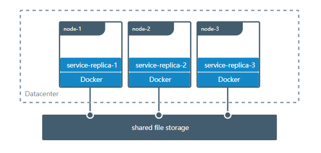

# 4.3 使用`volume`数据挂载

卷是保存Docker容器生成和使用的数据的首选机制。 虽然绑定挂载依赖于主机的目录结构，但卷完全由Docker管理。 卷绑定安装有几个优点：

- 与挂载相比，卷更易于备份或迁移。
- 您可以使用Docker CLI命令或Docker API管理卷。
- 卷适用于Linux和Windows容器。
- 可以在多个容器之间更安全地共享卷。
- 卷驱动程序允许您在远程主机或云提供程序上存储卷，加密卷的内容或添加其他功能。
- 新卷可以通过容器预先填充其内容。

此外，卷通常是比容器的可写层中的持久数据更好的选择，因为卷不会增加使用它的容器的大小，并且卷的内容存在于给定容器的生命周期之外。


如果容器生成非持久状态数据，请考虑使用tmpfs挂载以避免将数据永久存储在任何位置，并通过避免写入容器的可写层来提高容器的性能。

卷使用rprivate绑定传播，并且卷不可配置绑定传播。

## 1. 使用-v或者-mount参数

最初，`-v`或`--volume`标志用于独立容器，` -- mount`标志用于swarm服务。但是，从Docker 17.06开始，您还可以将`--mount`与独立容器一起使用。通常，` -- mount`更明确，更冗长。最大的区别是`-v`语法将所有选项组合在一个字段中，而`--mount`语法将它们分开。以下是每个标志的语法比较。

> 新用户应该尝试使用比`--volume`语法更简单的语法。

如果需要指定卷驱动程序选项，则必须使用`--mount`。

  - `-v`或`--volume`：由三个字段组成，用冒号字符（`:`)分隔。字段必须按正确的顺序排列，并且每个字段的含义不是很明显。

    - 对于命名卷，第一个字段是卷的名称，并且在给定主机上是唯一的。对于匿名卷，省略第一个字段。
    - 第二个字段是文件或目录在容器中安装的路径。
    - 第三个字段是可选的，是逗号分隔的选项列表，例如`ro`。这些选项将在下面讨论。
  - `--mount`：由多个键值对组成，用逗号分隔，每个键值由`<key> = <value>`元组组成。 `--mount`语法比`-v`或`--volume`更冗长，但键的顺序并不重要，并且标志的值更容易理解。

    - `mount`的类型，可以是`bind`，`volume`或`tmpfs`。本主题讨论卷，因此类型始终是卷。
    - `mount`的`source`。对于命名卷，这是卷的名称。对于匿名卷，省略此字段。可以指定为`source`或`src`。
    - 目标将其值作为容器中安装文件或目录的路径。可以指定为`destination`，`dst`或`target`。
    - `readonly`选项（如果存在）使绑定装入以只读方式装入容器中。
    - `volume-opt`选项可以多次指定，它采用由选项名称及其值组成的键值对。

> 从外部CSV解析器中转义值
> 如果您的卷驱动程序接受以逗号分隔的列表作为选项，则必须从外部CSV解析器中转义该值。要转义音量选择，请用双引号（“）将其括起来，并用单引号（'）括住整个mount参数。
> 例如，本地驱动程序将挂载选项作为o参数中的逗号分隔列表接受。此示例显示了转义列表的正确方法。

```shell
$ docker service create \
     --mount 'type=volume,src=<VOLUME-NAME>,dst=<CONTAINER-PATH>,volume-driver=local,volume-opt=type=nfs,volume-opt=device=<nfs-server>:<nfs-path>,"volume-opt=o=addr=<nfs-address>,vers=4,soft,timeo=180,bg,tcp,rw"'
    --name myservice \
    <IMAGE>
```

以下示例在可能的情况下显示`--mount`和`-v`语法，并首先显示`--mount`。

**-v和--mount行为之间的差异**

与绑定挂载相反，卷的所有选项都可用于`--mount`和`-v`标志。

将卷与服务一起使用时，仅支持`--mount`。

## 2. 创建和管理volume

与挂载不同，您可以创建和管理任何容器范围之外的卷。

创建卷:

```shell
$ docker volume create my-vol
```

查看所有卷:

```shell
$ docker volume ls

local               my-vol
```

查看卷详细信息:

```shell
$ docker volume inspect my-vol
[
    {
        "Driver": "local",
        "Labels": {},
        "Mountpoint": "/var/lib/docker/volumes/my-vol/_data",
        "Name": "my-vol",
        "Options": {},
        "Scope": "local"
    }
]
```

删除卷:

```shell
$ docker volume rm my-vol
```

## 3. 启动具有卷的容器
如果启动具有尚不存在的卷的容器，Docker会为您创建卷。 以下示例将卷`myvol2`安装到容器中的`/ app /`中。

下面的`-v`和`--mount`示例产生相同的结果。 除非在运行第一个容器和`myvol2`卷之后删除它，否则不能同时运行它们。

```shell
# --mount
$ docker run -d \
  --name devtest \
  --mount source=myvol2,target=/app \
  nginx:latest
  
# -v
$ docker run -d \
  --name devtest \
  -v myvol2:/app \
  nginx:latest
```

使用`docker inspect devtest`验证卷是否已创建并正确安装。 寻找`Mounts`部分：

```json
"Mounts": [
    {
        "Type": "volume",
        "Name": "myvol2",
        "Source": "/var/lib/docker/volumes/myvol2/_data",
        "Destination": "/app",
        "Driver": "local",
        "Mode": "",
        "RW": true,
        "Propagation": ""
    }
],
```

这表明`mount`是一个卷，它显示正确的源和目标，并且`mount`是可读写的。

停止容器并移除卷。 注意删除卷是一个单独的步骤。

```shell
$ docker container stop devtest

$ docker container rm devtest

$ docker volume rm myvol2
```

### 3.1. 使用volumes开启一个服务

启动服务并定义卷时，每个服务容器都使用自己的本地卷。 如果使用`local`卷驱动程序，则所有容器都不能共享此数据，但某些卷驱动程序确实支持共享存储。 Docker for AWS和Docker for Azure都支持使用Cloudstor插件的持久存储。

以下示例启动具有四个副本的`nginx`服务，每个副本使用名为`myvol2`的本地卷。

```shell
$ docker service create -d \
  --replicas=4 \
  --name devtest-service \
  --mount source=myvol2,target=/app \
  nginx:latest
```

使用`docker service ps devtest-service`验证服务是否正在运行：

```shell
$ docker service ps devtest-service

ID                  NAME                IMAGE               NODE                DESIRED STATE       CURRENT STATE            ERROR               PORTS
4d7oz1j85wwn        devtest-service.1   nginx:latest        moby                Running             Running 14 seconds ago
```

删除服务，停止其所有任务：

```shell
$ docker service rm devtest-service
```

删除该服务不会删除该服务创建的任何卷。 去除卷是一个单独的步骤。

**服务的语法差异**
`docker service create`命令不支持`-v`或`--volume`标志。 将卷安装到服务的容器中时，必须使用`--mount`标志。

### 3.2. 使用容器填充volume

如果启动一个创建新卷的容器（如上所述），并且容器在要挂载的目录中有文件或目录（例如`/ app /` ），则将目录的内容复制到卷中。 然后容器安装并使用该卷，而使用该卷的其他容器也可以访问预先填充的内容。

为了说明这一点，此示例启动一个`nginx`容器，并使用容器的`/ usr / share / nginx / html`目录的内容填充新卷`nginx-vol`，这是Nginx存储其默认HTML内容的位置。

`--mount`和`-v`示例具有相同的最终结果。

```shell
# --mount
$ docker run -d \
  --name=nginxtest \
  --mount source=nginx-vol,destination=/usr/share/nginx/html \
  nginx:latest
  
# -v
$ docker run -d \
  --name=nginxtest \
  -v nginx-vol:/usr/share/nginx/html \
  nginx:latest
```

运行这些示例之一后，运行以下命令以清理容器和卷。 注意删除卷是一个单独的步骤。

```shell
$ docker container stop nginxtest

$ docker container rm nginxtest

$ docker volume rm nginx-vol
```

## 4. 使用只读volume

对于某些开发应用程序，容器需要写入绑定装入，以便将更改传播回Docker主机。 在其他时候，容器只需要对数据的读访问权。 请记住，多个容器可以安装相同的卷，并且可以为其中一些容器以读写方式挂载，同时为其他容器以只读方式挂载。

此示例修改上面的一个，但通过在容器中的挂载点之后将`ro`添加到（默认情况下为空）选项列表，将目录挂载为只读卷。 如果存在多个选项，请用逗号分隔。

`--mount`和`-v`示例具有相同的结果。

```shell
# --mount
$ docker run -d \
  --name=nginxtest \
  --mount source=nginx-vol,destination=/usr/share/nginx/html,readonly \
  nginx:latest
  
# -v
$ docker run -d \
  --name=nginxtest \
  -v nginx-vol:/usr/share/nginx/html:ro \
  nginx:latest
```

使用`docker inspect nginxtest`验证是否正确创建了只读挂载。 寻找`Mounts`部分：

```json
"Mounts": [
    {
        "Type": "volume",
        "Name": "nginx-vol",
        "Source": "/var/lib/docker/volumes/nginx-vol/_data",
        "Destination": "/usr/share/nginx/html",
        "Driver": "local",
        "Mode": "",
        "RW": false,
        "Propagation": ""
    }
],
```
停止并移除容器，然后移除卷。 移除卷是一个单独的步骤。

```shell
$ docker container stop nginxtest

$ docker container rm nginxtest

$ docker volume rm nginx-vol
```

## 5. 在机器之间共享数据

构建容错应用程序时，可能需要配置同一服务的多个副本才能访问相同的文件。



在开发应用程序时，有几种方法可以实现此目的。 一种是为应用程序添加逻辑，以将文件存储在Amazon S3等云对象存储系统上。 另一种方法是使用支持将文件写入NFS或Amazon S3等外部存储系统的驱动程序创建卷。

卷驱动程序允许您从应用程序逻辑中抽象底层存储系统。 例如，如果您的服务使用具有NFS驱动程序的卷，则可以更新服务以使用其他驱动程序，例如在云中存储数据，而无需更改应用程序逻辑。

## 6. 使用volume驱动程序

使用`docker volume create`创建卷时，或者启动使用尚未创建的卷的容器时，可以指定卷驱动程序。 以下示例使用`vieux / sshfs`卷驱动程序，首先在创建独立卷时，然后在启动创建新卷的容器时使用。

## 7. 初始设置
此示例假定您有两个节点，第一个节点是Docker主机，可以使用SSH连接到第二个节点。

在Docker主机上，安装`vieux / sshfs`插件：

```shell
$ docker plugin install --grant-all-permissions vieux/sshfs
```

### 7.1. 使用卷驱动程序创建卷

此示例指定SSH密码，但如果两台主机配置了共享密钥，则可以省略密码。 每个卷驱动程序可以具有零个或多个可配置选项，每个选项都使用`-o`标志指定。

```shell
$ docker volume create --driver vieux/sshfs \
  -o sshcmd=test@node2:/home/test \
  -o password=testpassword \
  sshvolume
```

### 7.2. 创建一个创建NFS卷的服务

此示例显示如何在创建服务时创建NFS卷。 此示例使用`10.0.0.10`作为NFS服务器，使用`/ var / docker-nfs`作为NFS服务器上的导出目录。 请注意，指定的卷驱动程序是`local`的。

**NFSV3**

```shell
$ docker service create -d \
  --name nfs-service \
  --mount 'type=volume,source=nfsvolume,target=/app,volume-driver=local,volume-opt=type=nfs,volume-opt=device=:/var/docker-nfs,volume-opt=o=addr=10.0.0.10' \
  nginx:latest
```

**NFSV4**

```shell
docker service create -d \
    --name nfs-service \
    --mount 'type=volume,source=nfsvolume,target=/app,volume-driver=local,volume-opt=type=nfs,volume-opt=device=:/,"volume-opt=o=10.0.0.10,rw,nfsvers=4,async"' \
    nginx:latest`
```

## 8. 备份，还原或迁移数据卷

卷对备份，还原和迁移很有用。 使用--volumes-from标志创建一个安装该卷的新容器。

### 8.1. 备份容器

例如，在下一个命令中，我们：

  - 启动新容器并从dbstore容器装入卷
  - 将本地主机目录挂载为/ backup
  - 将包含dbdata卷内容的命令传递到/ backup目录中的backup.tar文件。

```shell
$ docker run --rm --volumes-from dbstore -v $(pwd):/backup ubuntu tar cvf /backup/backup.tar /dbdata
```

当命令完成并且容器停止时，我们将留下dbdata卷的备份。

### 8.2. 从备份还原容器

使用刚刚创建的备份，您可以将其还原到同一容器或您在其他位置创建的另一个容器。

例如，创建一个名为`dbstore2`的新容器：

```shell
$ docker run -v /dbdata --name dbstore2 ubuntu /bin/bash
```

然后解压缩新容器的数据卷中的备份文件：

```shell
$ docker run --rm --volumes-from dbstore2 -v $(pwd):/backup ubuntu bash -c "cd /dbdata && tar xvf /backup/backup.tar --strip 1"
```

您可以使用上述技术使用首选工具自动执行备份，迁移和还原测试。

## 9. 删除卷

删除容器后，Docker数据卷仍然存在。 要考虑两种类型的卷：

命名卷具有来自容器外部的特定源，例如awesome：/ bar。
匿名卷没有特定的源，因此在删除容器时，指示Docker Engine守护程序删除它们。

### 9.1. 删除匿名卷

要自动删除匿名卷，请使用--rm选项。 例如，此命令创建匿名/ foo卷。 移除容器后，Docker Engine会删除/ foo卷但不会删除令人敬畏的卷。

```shell
$ docker run --rm -v / foo -v awesome：/ bar busybox top
```

### 9.2. 删除所有卷

要删除所有未使用的卷并释放空间：

```shell
$ docker volume prune
```