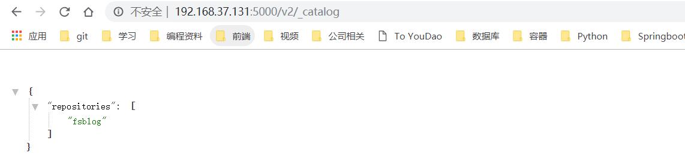

# 4.6 Docker中的Java容器化

## 1. 前置条件

- JDK 1.8+
- Gradle 2.3+
- Docker 最新版。有关 Docker 在的安装，可以参阅 [Docker 的安装](http://172.22.3.3/Hakugei/docker#%E4%BA%8C%E5%AE%89%E8%A3%85)

## 2. 用 Gradle 构建项目

创建一个简单的Gradle项目：目录结构如下

```
├─ gradle/                  - gradle工作目录，存放一些gradle命令和gradle-wrapper包。
	├─ .idea/                   - idea工作目录，存放了idea项目的一些描述文件等。
	├─ .build/                  - gradle构建结果的输出目录。
	├─ script					- 存放一些构建脚本文件
	 ├─ gradle
	  ├─ config.gradle			- 配置脚本 
	  ├─ docker.gradle			- docker构建相关gradle脚本
	├─ src/                     - 源代码目录（该目录中的目录结构是由gradle java plugin约定的）
	|  ├─main/                  - 实现代码
	|  |  ├─java/               - java代码
	|  |  └─resources/          - 静态资源文件
	|  ├─test/                  - 测试代码
	|  |  ├─java/               - java代码
	|  |  └─resources/          - 静态资源文件 
	├─ .gitgnore                - git忽略文件
	├─ Dockerfile				- Dockerfile文件
	├─ gradlew                  - Gradle start up script for UN*X
	├─ gradlew.bat              - Gradle startup script for Windows
	├─ build.gradle             - gradle构建脚本
	└─ README.markdown  
```

## 3. 编写相关配置文件

第一步我们来编写`config.gradle`:

```groovy
// group名称
group 'com.blog.demo'
// 版本号
version '1.0.0'
ext {
    // jar包所在模块名称
    jarProjectName = 'fsblog'
    // jar包发布的实际名称
    jarArchivesBaseName =  'fsblog'
    // jar包版本
    jarVersion = version
    // maven仓库地址
    mavenUrl =  'http://maven.aliyun.com/nexus/content/groups/public/'

    dockerConfig = [
            // docker远端构建进程配置地址
            url : 'http://192.168.37.131:2375/',

            // docker发布仓库地址及认证信息
            registryCredentials : [
                    // 发布的镜像仓库地址
                    url : 'http://192.168.37.131:5000',
            ],
            // image镜像对应的前缀域名
            imageDomain:'192.168.37.131:5000',
            // 发布类型 jar or war
            publishType: 'jar'
    ]
}
```

`docker.gradle`:

```groovy
buildscript {
    repositories {
        maven {
            url 'http://maven.aliyun.com/nexus/content/groups/public/'
        }
        maven {
            url "https://plugins.gradle.org/m2/"
        }
    }
    dependencies {
        classpath("com.bmuschko:gradle-docker-plugin:3.2.1")
    }
}
// 使用bmuschko的插件来构建Docker镜像，不依赖本地有docker环境
apply plugin: com.bmuschko.gradle.docker.DockerRemoteApiPlugin

def $dkConfig = ext.dockerConfig
// docker远端配置信息
docker {
    // docker远端构建进程配置地址
    url = $dkConfig.url
    // docker发布仓库地址
    registryCredentials {
        url = $dkConfig.registryCredentials.url
    }
}
// 在idea中引入会报无法解析bmuschko，但不影响执行效果
import com.bmuschko.gradle.docker.tasks.image.DockerBuildImage
import com.bmuschko.gradle.docker.tasks.image.DockerPushImage
import com.bmuschko.gradle.docker.tasks.image.DockerRemoveImage
import com.bmuschko.gradle.docker.tasks.image.Dockerfile

// 拷贝jar包到docker发布目录
task copyJarToDockerFD(type: Copy) {
    dependsOn "build"
    from "./build/libs/$jarArchivesBaseName" + "-" + project.version + ".jar"
    into "build/docker/"
}

// 拷贝dockerfile到docker发布目录
task copyDockerFile(type: Copy) {
    from './Dockerfile'
    into 'build/docker/'
}

// 构建镜像
task buildImage(type: DockerBuildImage) {
    dependsOn copyDockerFile, copyJarToDockerFD
    group = 'Docker'
    inputDir = project.file('build/docker/')
    tag =$dkConfig.imageDomain + "/$jarProjectName:" + project.version
}

// 发布镜像
task pushImageToRegister(type: DockerPushImage) {
    group = 'Docker'
    dependsOn buildImage
    conventionMapping.imageName = { buildImage.getTag() }
}

// 移除build生成的镜像
task removeBuildImage(type: DockerRemoveImage) {
    group = 'Docker'
    force = true
    targetImageId { buildImage.getImageId() }
}

// 发布镜像
task pushImage() {
    dependsOn pushImageToRegister
    dependsOn removeBuildImage
    removeBuildImage.mustRunAfter pushImageToRegister
}
```

## 4. 搭建一个本地`docker registry`

首先我们需要一台有外网的机器，应为我们首先需要获取**registry**镜像：

```shell
sudo docker pull registry:2
```


启动容器运行registry镜像

```shell
docker run -d -p 5000:5000 --restart=always  -v /opt/registry:/var/lib/registry registry:2
```


> 说明：
>
> -d ==> 作为daemon进程启动，也就是后台启动
>
> -v /opt/registry:/tmp/registry ==> 默认情况下，会将仓库存放于容器内的/tmp/registry目录下，指定本地目录/opt/registry挂载到容器，可以防止容器意外停止后镜像的丢失。
>
> -p 5000:5000 ==> 前一个5000是host的端口，后一个是容器的端口。这里是将容器的5000端口映射到host的5000端口
>
> --restart 标志会检查容器的退出代码，并据此来决定是否要重启容器，默认是不会重启。
> --restart的参数说明
> always：无论容器的退出代码是什么，Docker都会自动重启该容器。
> on-failure：只有当容器的退出代码为非0值的时候才会自动重启。另外，该参数还接受一个可选的重启次数参数，`--restart=on-fialure:5`表示当容器退出代码为非0时，Docker会尝试自动重启该容器，最多5次。

配置https权限支持

```shell
 vi /etc/docker/daemon.json
```


防火墙添加5000端口

```shell
firewall-cmd --zone=public --add-port=5000/tcp --permanent
firewall-cmd --reload
```

重启docker服务

```shell
systemctl restart docker
```

## 5. 编写Dockerfile文件

```dockerfile
FROM java:openjdk-8-alpine

ADD fsblog-1.0.0.jar app.jar

RUN sh -c 'touch /app.jar'

ENV JAVA_OPTS=""

ENTRYPOINT [ "sh", "-c", "java $JAVA_OPTS -Djava.security.egd=file:/dev/./urandom -jar /app.jar" ]
```

> 注意：
>
> 因为镜像包含系统完整的root文件系统，其体积往往是庞大的，因此在Docker设计时，就充分利用Union FS技术，将其设计为分层存储的架构。所以严格来说，镜像并非是像一个ISO那样的打包文件，镜像只是一个虚拟的概念，其实际体现并非由一个文件组成，而是由一组文件系统组成，或者说，由多层系统联合组成。
> 镜像构建时会一层层构建，前一层是后一层的基础。每一层构建完就不会再发生改变，后一层上的任何改变只发生在自己这一层，比如，删除前一层文件的操作，实际不是真的删除前一层的文件，而是仅在当前层标记为该文件已删除。在最终容器运行的时候，虽然不会看到这个文件，但是实际上该文件会一直跟随镜像。因此，在构建镜像的时候，需要额外小心，每一层尽量只包含该层需要添加的东西，任何额外的东西应该在该层构建结束前清理掉。
> 分层存储的特征还使得镜像的复用、定制变的更为容易。甚至可以用之前构建好的镜像作为基础层，然后进一步添加新的层，以定制自己所需要的内容，构建新的镜像。

## 6. 构建镜像

执行`buildImage`命令


执行成功如图所示：


然后执行`pushImageToRegister`命令推送到自己的仓库，当然也可以直接执行`pushImageToRegister`命令一步到位，构建镜像并推送到仓库。


> 镜像构建完成后，可以很容易的在当前宿主机上运行，但是，如果需要在其它服务器上使用这个镜像，我们就需要一个集中的存储、分发镜像的服务，Docker Registry就是这样的服务。
> 一个Docker Registry中可以包含多个仓库(Repository);每个仓库可以包含多个标签(tag)；每个标签对应一个镜像。
> 通常，一个仓库会包含一个软件不同版本的镜像，而标签就常用于对应该软件的各个版本。我们可以通过<仓库名>:<标签>的格式来指定具体是这个软件那个版本的镜像。如果不给出标签，将以laest作为默认标签。
> 以ubuntu镜像为例，ubuntu是仓库的名字，其包含有不同的版本标签，如，14.04,16.04。我们可以通过ubuntu:14.04或者ubuntu:16.04来具体指定所需要哪个版本的镜像。如果忽略了标签，比如ubuntu,那将视为ubuntu:latest。
> 仓库名经常以两段式路径形式出现，比如jwilder/nginx-proxy,前者意味着Docker Registry多用户环境下的用户名，后者则往往是对应的软件名。但这并非绝对，取决于所使用的具体Docker Registry的软件或服务。

接下来来看看仓库中有没有我们刚刚推送的镜像：

1. 访问仓库`ip:port/v2/_catalog`,出现如下数据则表示推送成功，仓库中存在我们刚刚推送的镜像



1. 或者执行`curl http://192.168.37.131:5000/v2/_catalog`，如下图同样表示成功


3.测试镜像是否可以运行

执行`docker pull 192.168.37.131:5000/fsblog:1.0.0`获取镜像


运行镜像`docker run -p 8666:8083 image_id`


成功运行！接下来我们访问一下，这里是将容器的8083端口映射到主机的8666端口，所以我们只要访问虚拟机的`ip：8666`即可：


至此，成功的使用 Docker、Gradle 来构建、运行、发布一个 Spring Boot 应用了。

本文档简要的介绍了一下Docker的基本知识，以及如何利用Gradle和Docker来构建运行，发布一个Spring Boot应用，这些都是目前流行的框架和工具，当然由于本人水平有限，还有许多方面的知识没有涉及到以及在文中叙述可能有一些不准确的地方，希望大家予以帮助，对于Docker的使用类似于服务，集群，应用栈等在本文中没有去实践，有兴趣的同学们可以参考官方文档自行去尝试，对于私有镜像仓库还可以扩展为如何搭建一个https的私有仓库，需要认证才能使用，进一步的可以去了解Harbor镜像仓库的实现，以及`K8s`容器编排工具， Rancher等的原理及使用，这些是进一步的学习方向。谢谢观看。


