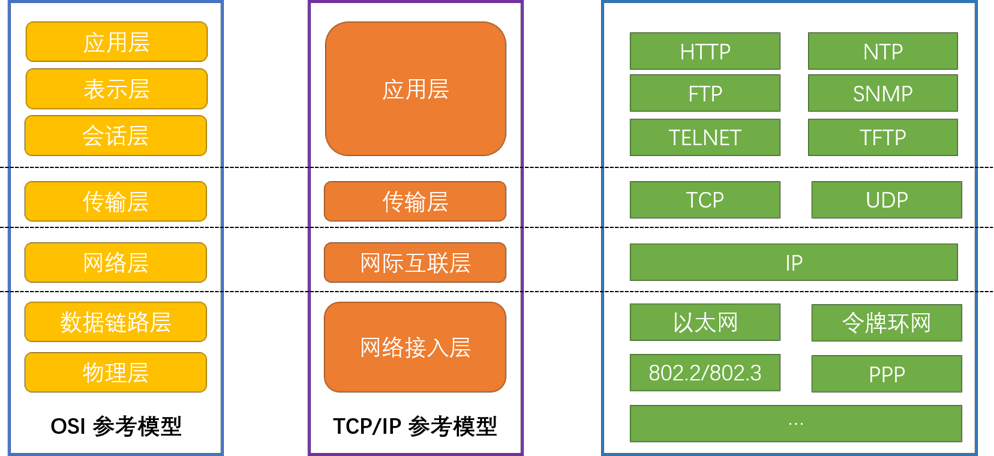

## 1. 概览

### 1.1. `keepalived`是什么?

`keepalived`是用`C语言`编写的`路由软件`。该项目的主要目的是为Linux系统或基于Linux的基础架构提供轻量的、可靠的`负载均衡`和`高可用`能力。

>高可用(HA, High Available): 两个服务器节点启动着相同的服务，如果有一个故障，另一个自动接管，我们将将这个称之为高可用。

### 1.2. `keepalived`解决了什么问题?

负载均衡是服务虚拟化的一个很好的解决方案。设计负载均衡结构时必须特别注意两个问题：
  * 使用`健康检查`保证真实服务器的可用性：具有负载均衡能力的服务器，提供了全局的、高可用的虚拟服务。为了提高虚拟服务的可用性，我们通过使用健康检查机制来监视每个服务器节点。
  * 使用`故障转移`保证负载均衡的可用性：在使用负载均衡调度时，我们会面临虚拟服务单点故障的问题。因此，还必须使用专门的路由协议实现故障转移来保证负载均衡调度的高可用性。

`keepalived`引入强大而健壮的`健康检查`机制，并找到`故障转移`的解决方案，去解决上述两个问题。如果有一台服务器宕机，或工作出现故障，`keepalived`将检测到，并将有故障的服务器从系统中剔除，同时使用其他服务器代替该服务器的工作，当服务器工作正常后`keepalived`自动将服务器加入到服务器群中，这些工作全部自动完成，不需要人工干涉，需要人工做的只是修复故障的服务器。

### 1.3. `keepalived`是如何解决上述问题的？

`keepalived`的`健康检查（health-checks）`机制采用TCP连接请求、ICMP请求、HTTP请求等方式对负载均衡器后面的实际的服务器(通常是承载真实业务的服务器)进行保活，保证真实服务的可用性。利用`健康检查`机制，`keepalived`可以根据服务器运行状态，自适应地维护和管理负载均衡的服务器池。

`keepalived`的`故障转移`方案基于`VRRP`实现高可用性。`故障转移`主要是应用于配置了主备模式的负载均衡器，利用`VRRP`维持主备负载均衡器的心跳，当主负载均衡器出现问题时，由备负载均衡器承载对应的业务，从而在最大限度上减少流量损失，保证负载均衡的稳定性。此外，`keepalived`还实现了一组`VRRP`有限状态机的钩子，从而提供了轻量且高速的协议交互。为了提供最快的网络故障检测，`keepalived`还采用了BFD协议，`VRRP`可以通过BFD协议来驱动状态快速转换。 `keepalived`框架可以独立使用，也可以作为弹性基础架构和其它框架一起配合使用。

>故障转移(failover): 是一种备份操作模式，当主要组件由于失效或预定关机时间的原因而无法工作时，这种模式中的系统组件（比如处理机、服务器、网络或数据库）的功能被转接到备用组件。

>VRRP(Virtual Router Redundancy Protocol): 虚拟路由冗余协议，解决局域网中配置静态网关出现单点失效现象的路由协议。

`keepalived`工作在`TCP/IP参考模型`的网际互连层、传输层、应用层：

* 网际互连层（Layer3）：`keepalived`通过ICMP协议向服务器集群中的每一个节点发送一个ICMP数据包(有点类似于`Ping`的功能)，如果某个节点没有返回响应数据包，那么认为该节点发生了故障，`keepalived`将报告这个节点失效，并从服务器集群中剔除故障节点。

* 传输层（Layer4）：`keepalived`在传输层里利用了TCP协议的端口连接和扫描技术来判断集群节点的端口是否正常，比如对于常见的Web服务器`80`端口、SSH服务`22`端口，`keepalived`一旦在传输层探测到这些端口号没有数据响应和数据返回，就认为这些端口发生异常，然后强制将这些端口所对应的节点从服务器集群中剔除掉。

* 应用层（Layer5/6/7）：`keepalived`在应用层的运行方式全面化和复杂化，用户可以通过自定义`keepalived`工作方式，例如：可以通过编写程序或者脚本来运行`keepalived`，而`keepalived`将根据用户的设定参数检测各种程序或者服务是否允许正常，如果`keepalived`的检测结果和用户设定的不一致时，`keepalived`将把对应的服务器从服务器集群中剔除。
