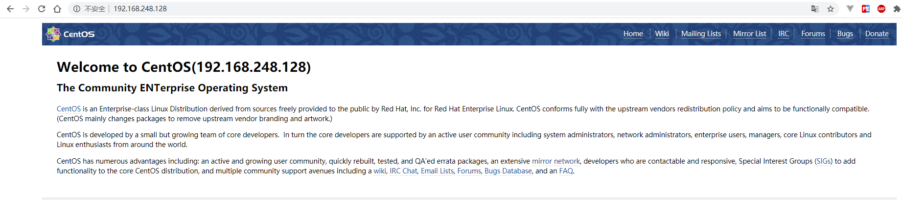
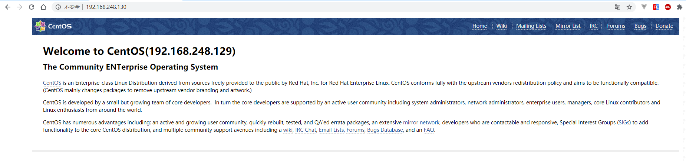
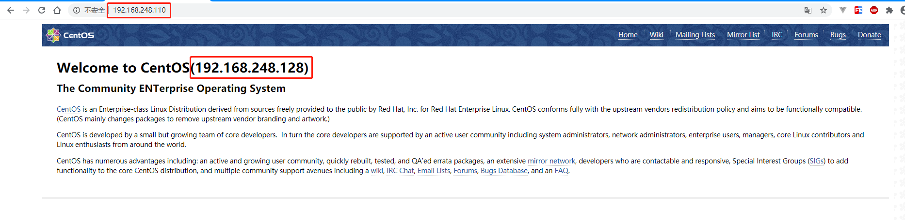

## 3. 用例：keepalived高可用+nginx负载均衡

### 3.1. 准备环境

* 4 * 虚拟机：
  * 内存：1GB
  * 处理器：1 * 2 Core
  * 存储：20GB
  * 操作系统：CentOS 7

* 虚拟机IP地址分配和作用如下表：

| 名称 |     IP地址      | 作用 |
| :--- | :-------------- | :--- |
| ka1  | 192.168.248.128 | 基于`nginx`静态资源托管的静态页面1（效果展示用） |
| ka2  | 192.168.248.129 | 基于`nginx`静态资源托管的静态页面2（效果展示用） |
| ka3  | 192.168.248.130 | 基于`nginx`的负载均衡器和`keepalived`主服务器 |
| ka4  | 192.168.248.131 | 基于`nginx`的负载均衡器和`keepalived`备服务器 |


* 注意事项：

```shell
# 关闭防火墙
$ systemctl stop firewalld
# 关闭selinux，重启生效
$ sed -i 's/^SELINUX=.*/SELINUX=disabled/' /etc/sysconfig/selinux
# 时间同步
$ ntpdate 0.centos.pool.ntp.org
# 允许组播
$ iptables -A INPUT -d 224.0.0.18 -j ACCEPT
```

### 3.2. 搭建静态页面和负载均衡器

1. 安装`nginx`，四台虚拟机均需要安装：

```
$ yum install nginx
```

2. 命令行输入`vi /usr/share/nginx/html/index.html`打开默认托管页面的`html`文件，在页面中增加所在主机`IP`信息，以区分托管服务的`真实服务`

```html
<div id="content">
  <!-- 标题处增加IP信息，ka1和ka2分别添加相应IP -->
  <h1>Welcome to CentOS(192.168.248.129)</h1>
  ...
</div>
```

3. 启动`nginx`：

```
$ systemctl start nginx
```

4. 浏览器访问`ka1`(192.168.248.128)页面：



1. 浏览器访问`ka2`(192.168.248.129)页面：


1. 命令行输入`vi /etc/nginx/nginx.conf`打开`nginx`默认配置文件，配置负载均衡：

```conf
# ka3、ka4配置保持一致
http {
 ...

 # 增加负载均衡配置
 upstream loadbalance {
     server 192.168.248.128:80 weight=1 max_fails=3 fail_timeout=20s;
     server 192.168.248.129:80 weight=1 max_fails=3 fail_timeout=20s;
 }

 server {
     listen 80;
     server_name  localhost;

     location / {
         # 增加请求路由配置
         proxy_pass http://loadbalance;
         proxy_set_header Host $host:$proxy_port;
         proxy_set_header X-Forwarded-For $remote_addr;
     }
  }
}
```

7. 浏览器访问`ka3`、`ka4`的`IP`地址，确认`192.168.248.130`、`192.168.248.131`都能被负载均衡路由到`192.168.248.128`、`192.168.248.129`页面，以`ka3`为例：




### 3.3. 配置并启动keepalived

1. 命令行输入`vi /etc/keepalived/keepalived.conf`，修改配置文件，如下：

```
! Configuration File for keepalived

# ka3的state配置为MASTER，ka4配置为BACKUP

global_defs {
   router_id LVS_DEVEL
}

vrrp_instance VI_1 {
    state MASTER
    interface ens33
    virtual_router_id 51
    priority 100
    advert_int 1
    authentication {
        auth_type PASS
        auth_pass 1111
    }
    virtual_ipaddress {
        192.168.248.110/24 dev ens33 label ens33:1
    }
}
```

2. 分别在`ka3`、`ka4`上输入以下命令启动`keepalived`：

```
$ systemctl start keepalived
```

3. 启动完毕后，在`ka3`上输入`ip a`查看IP信息，可以看到`虚拟IP`已`漂移`到网口上：

```shell
[root@ka3 ~]# ip a
1: lo: <LOOPBACK,UP,LOWER_UP> mtu 65536 qdisc noqueue state UNKNOWN qlen 1
    link/loopback 00:00:00:00:00:00 brd 00:00:00:00:00:00
    inet 127.0.0.1/8 scope host lo
       valid_lft forever preferred_lft forever
    inet6 ::1/128 scope host 
       valid_lft forever preferred_lft forever
2: ens33: <BROADCAST,MULTICAST,UP,LOWER_UP> mtu 1500 qdisc pfifo_fast state UP qlen 1000
    link/ether 00:0c:29:a0:d4:6d brd ff:ff:ff:ff:ff:ff
    inet 192.168.248.130/24 brd 192.168.248.255 scope global dynamic ens33
       valid_lft 1139sec preferred_lft 1139sec
    inet 192.168.248.110/24 scope global secondary ens33:1
       valid_lft forever preferred_lft forever
    inet6 fe80::41d7:702a:97de:24a1/64 scope link 
       valid_lft forever preferred_lft forever
```

4. 浏览器访问虚拟IP地址`192.168.248.110`，可以路由到`192.168.248.128`、`192.168.248.129`页面：



1. 关闭主服务器虚拟机`ka3`电源，在`ka4`上输入`ip a`查看IP信息，可以看到`虚拟IP`已`漂移`到网口上：

```shell
[root@ka4 ~]# ip a
1: lo: <LOOPBACK,UP,LOWER_UP> mtu 65536 qdisc noqueue state UNKNOWN qlen 1
    link/loopback 00:00:00:00:00:00 brd 00:00:00:00:00:00
    inet 127.0.0.1/8 scope host lo
       valid_lft forever preferred_lft forever
    inet6 ::1/128 scope host 
       valid_lft forever preferred_lft forever
2: ens33: <BROADCAST,MULTICAST,UP,LOWER_UP> mtu 1500 qdisc pfifo_fast state UP qlen 1000
    link/ether 00:0c:29:20:5b:61 brd ff:ff:ff:ff:ff:ff
    inet 192.168.248.131/24 brd 192.168.248.255 scope global dynamic ens33
       valid_lft 1532sec preferred_lft 1532sec
    inet 192.168.248.110/24 scope global secondary ens33:1
       valid_lft forever preferred_lft forever
    inet6 fe80::b5bd:569f:3e1a:b773/64 scope link 
       valid_lft forever preferred_lft forever
```

6. 浏览器访问`虚拟IP`地址`192.168.248.110`，仍可以路由到`192.168.248.128`、`192.168.248.129`页面，至此，`keepalived`高可用+`nginx`负载均衡试验完毕！
