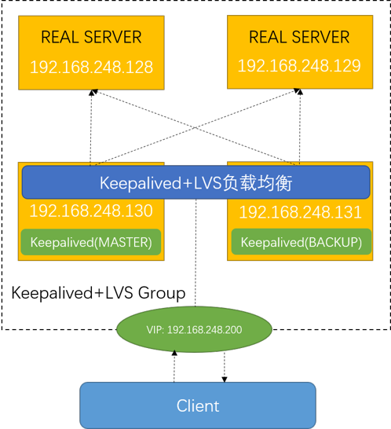
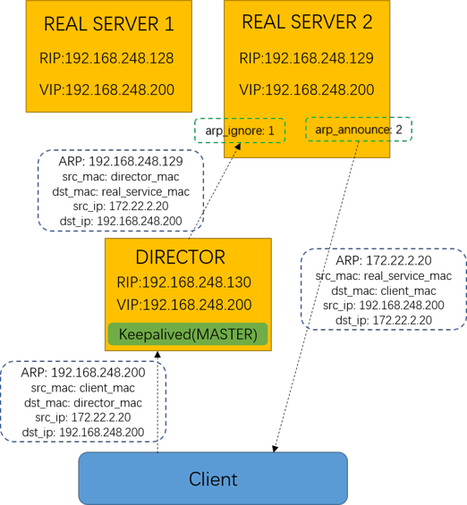
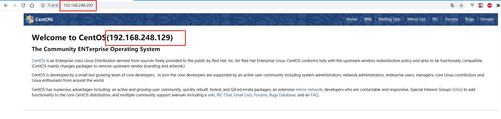

## 4. 用例：`keepalived`+`LVS`高可用负载均衡

### 4.1. `LVS`简介

> `LVS`部分术语定义：
>
> Real server: A real server hosts the application accessed by client requests.
>
> Server pool: A farm of real servers.
>
> Virtual server: The access point to a Server pool.
>
> Virtual Service: A TCP/UDP service associated with the VIP.
>
> VIP: The Virtual IP is the IP address that will be accessed by all the clients. The clients only access this IP address.
>
> RIP: The IP address of real server.

`Linux虚拟服务器(LVS, Linux Virtual Server)`是由章文嵩博士主导的开源Linux服务器集群系统，是中国国内最早出现的自由软件项目之一，目前`LVS`已经被集成到Linux内核模块中。

`keepalived`依靠`Linux虚拟服务器`的核心模块实现了`OSI（Open System Interconnection，开放系统互联）模型`传输层的负载均衡能力。

#### 三种工作模式：

1. 基于`NAT`的LVS模式负载均衡：NAT（Network Address Translation）即网络地址转换，其作用是通过数据报头的修改，使得位于企业内部的私有IP地址可以访问外网，以及外部用用户可以访问位于公司内部的私有IP主机。
2. 基于`TUN`的LVS负载均衡：我们知道，数据请求包往往远小于响应数据包的大小。因为响应数据包中包含有客户需要的具体数据，所以LVS（TUN）的思路就是将请求与响应数据分离，让调度器仅处理数据请求，而让真实服务器响应数据包直接返回给客户端。
3. 基于`DR`的LVS负载均衡：DR（Dirct Routing）模式也叫直接路由模式，该模式中LVS依然仅承担数据的入站请求以及根据算法选出合理的真实服务器，最终由后端真实服务器负责将响应数据包发送返回给客户端。与隧道模式不同的是，DR模式要求调度器与后端服务器必须在同一个局域网内，这样客户端访问的是调度器的VIP地址，回应的源地址也依然是该VIP地址。

#### 十种负载均衡调度算法：

* 轮询调度（Round Robin 简称'RR'）
* 加权轮询调度（Weight Round Robin 简称'WRR'）
* 最小连接调度（Least Connections 简称'LC'）
* 加权最少连接（Weight Least Connections 简称'WLC'）
* 基于局部的最少连接（Locality-Based Least Connections 简称'LBLC'）
* 带复制的基于局部性的最少连接（Locality-Based Least Connections with Replication  简称'LBLCR'）
* 目标地址散列调度（Destination Hashing 简称'DH'）
* 源地址散列调度（Source Hashing  简称'SH'）
* 最短的期望的延迟（Shortest Expected Delay 简称'SED'）
* 最少队列调度（Never Queue 简称'NQ'）

### 4.2. 准备环境

* 4 * 虚拟机：
  * 内存：1GB
  * 处理器：1 * 2 Core
  * 存储：20GB
  * 操作系统：CentOS 7

* 虚拟机IP地址分配和作用如下表：

| 名称 |     IP地址      | 作用 |
| :--- | :-------------- | :--- |
| ka1  | 192.168.248.128 | 基于`nginx`静态资源托管的静态页面1（效果展示用） |
| ka2  | 192.168.248.129 | 基于`nginx`静态资源托管的静态页面2（效果展示用） |
| ka3  | 192.168.248.130 | 基于`LVS`负载均衡配置的`keepalived`主服务器 |
| ka4  | 192.168.248.131 | 基于`LVS`负载均衡配置的`keepalived`备服务器 |



* 注意事项：

```shell
# 关闭防火墙
$ systemctl stop firewalld
# 关闭selinux，重启生效
$ sed -i 's/^SELINUX=.*/SELINUX=disabled/' /etc/sysconfig/selinux
# 时间同步
$ ntpdate 0.centos.pool.ntp.org
# 允许组播
$ iptables -A INPUT -d 224.0.0.18 -j ACCEPT
```

### 4.3. 配置真实服务器(Real Server)的虚拟IP(VIP)和ARP规则

1. 命令行输入`ip a`查看IP初始信息：

```shell
[root@ka2 ~]# ip a
1: lo: <LOOPBACK,UP,LOWER_UP> mtu 65536 qdisc noqueue state UNKNOWN qlen 1
    link/loopback 00:00:00:00:00:00 brd 00:00:00:00:00:00
    inet 127.0.0.1/8 scope host lo
       valid_lft forever preferred_lft forever
    inet6 ::1/128 scope host 
       valid_lft forever preferred_lft forever
2: ens33: <BROADCAST,MULTICAST,UP,LOWER_UP> mtu 1500 qdisc pfifo_fast state UP qlen 1000
    link/ether 00:0c:29:22:d1:3d brd ff:ff:ff:ff:ff:ff
    inet 192.168.248.129/24 brd 192.168.248.255 scope global dynamic ens33
       valid_lft 1297sec preferred_lft 1297sec
    inet6 fe80::dc21:6770:bc26:68ad/64 scope link 
       valid_lft forever preferred_lft forever
    inet6 fe80::41d7:702a:97de:24a1/64 scope link tentative dadfailed 
       valid_lft forever preferred_lft forever
```

2. 输入以下命令增加虚拟`IP`和路由：

```shell
$ ifconfig lo:0 192.168.248.200 netmask 255.255.255.255
$ route add -host 192.168.248.200 dev lo:0
```

3. 修改`ARP`设置：
   
```shell
net.ipv4.conf.all.arp_ignore = 1 # 仅当ARP目标IP地址是传入接口上配置的本地地址时才回复
net.ipv4.conf.all.arp_announce = 2 # 始终为此ARP目标使用最佳的本地地址。 在这种模式下，我们将忽略IP数据包中的源地址，并尝试选择我们希望与目标主机进行对话的本地地址
net.ipv4.conf.default.arp_ignore = 1
net.ipv4.conf.default.arp_announce = 2
net.ipv4.conf.lo.arp_ignore = 1
net.ipv4.conf.lo.arp_announce = 2
```

>ARP：Address Resolution Protocol，地址解析协议，是根据IP地址获取物理地址的一个TCP/IP协议。
>arp_ignore:  INTEGER Define different modes for sending replies in response to received ARP requests that resolve local target IP addresses
>arp_announce:  INTEGER Define different restriction levels for announcing the local source IP address from IP packets in ARP requests sent on interface



1. 命令行输入`ip a`查看修改后的IP信息：
```
[root@ka2 ~]# ip a
1: lo: <LOOPBACK,UP,LOWER_UP> mtu 65536 qdisc noqueue state UNKNOWN qlen 1
    link/loopback 00:00:00:00:00:00 brd 00:00:00:00:00:00
    inet 127.0.0.1/8 scope host lo
       valid_lft forever preferred_lft forever
    inet 192.168.248.200/32 scope global lo:0
       valid_lft forever preferred_lft forever
    inet6 ::1/128 scope host 
       valid_lft forever preferred_lft forever
2: ens33: <BROADCAST,MULTICAST,UP,LOWER_UP> mtu 1500 qdisc pfifo_fast state UP qlen 1000
    link/ether 00:0c:29:22:d1:3d brd ff:ff:ff:ff:ff:ff
    inet 192.168.248.129/24 brd 192.168.248.255 scope global dynamic ens33
       valid_lft 1096sec preferred_lft 1096sec
    inet6 fe80::dc21:6770:bc26:68ad/64 scope link 
       valid_lft forever preferred_lft forever
    inet6 fe80::41d7:702a:97de:24a1/64 scope link tentative dadfailed 
       valid_lft forever preferred_lft forever
```

### 4.4. 配置主备服务器keepalived的LVS设置，测试：

1. 命令行输入`vi /etc/keepalived/keepalived.conf`修改配置如下：

```conf
! Configuration File for keepalived
# ka3的state配置为MASTER，ka4配置为BACKUP

global_defs {
   router_id LVS_DEVEL
}

vrrp_instance VI_1 {
    state BACKUP
    interface ens33
    virtual_router_id 51
    priority 100
    advert_int 1
    authentication {
        auth_type PASS
        auth_pass 1111
    }
    virtual_ipaddress {
        192.168.248.200/24 dev ens33 label ens33:1
    }
}
# 定义对外提供服务的LVS的VIP以及port
virtual_server 192.168.248.200 80 {
    delay_loop 6 # 设置健康检查时间，单位是秒
    lb_algo rr # 设置负载调度的算法为rr,可选参数有wrr,lc.wlc.lblc,sh,dh,默认wlc
    lb_kind DR # 设置LVS实现负载的机制，有NAT、TUN、DR三个模式
    nat_mask 255.255.255.0
    persistence_timeout 3 #指定时间内，同ip的请求会转发到同一个服务
    protocol TCP
    real_server 192.168.248.128 80 {  # 指定real server1的IP地址
        weight 3   # 配置节点权值，数字越大权重越高
        TCP_CHECK {
          connect_timeout 10
          nb_get_retry 3
          delay_before_retry 3
          connect_port 80
        }
    }
    real_server 192.168.248.129 80 {  # 指定real server2的IP地址
        weight 3  # 配置节点权值，数字越大权重越高
        TCP_CHECK {
          connect_timeout 10
          nb_get_retry 3
          delay_before_retry 3
          connect_port 80
        }
     }
}

```

2. 启动`ka1`、`ka2`的`nginx`，以显示静态页面：

```
$ systemctl start nginx
```

3. 启动`ka3`、`ka4`的`keepalieved`，以启动高可用负载均衡：

```
$ systemctl start keepalived
```

4. 查看主服务器的`IP`信息，虚拟IP地址`192.168.248.200`已`漂移`到该服务器：

```
[root@ka3 ~]# ip a
1: lo: <LOOPBACK,UP,LOWER_UP> mtu 65536 qdisc noqueue state UNKNOWN qlen 1
    link/loopback 00:00:00:00:00:00 brd 00:00:00:00:00:00
    inet 127.0.0.1/8 scope host lo
       valid_lft forever preferred_lft forever
    inet6 ::1/128 scope host 
       valid_lft forever preferred_lft forever
2: ens33: <BROADCAST,MULTICAST,UP,LOWER_UP> mtu 1500 qdisc pfifo_fast state UP qlen 1000
    link/ether 00:0c:29:20:5b:61 brd ff:ff:ff:ff:ff:ff
    inet 192.168.248.130/24 brd 192.168.248.255 scope global dynamic ens33
       valid_lft 1044sec preferred_lft 1044sec
    inet 192.168.248.200/24 scope global secondary ens33:1
       valid_lft forever preferred_lft forever
    inet6 fe80::b5bd:569f:3e1a:b773/64 scope link tentative dadfailed 
       valid_lft forever preferred_lft forever
```

5. 浏览器访问虚拟`IP`地址`192.168.248.200`，可路由到`192.168.248.128`、`192.168.248.129`页面：



1. 关闭主服务器虚拟机`ka3`电源，在`ka4`上输入`ip a`查看IP信息，可以看到虚拟`IP`已`漂移`到网口上：

```shell
[root@ka4 ~]# ip a
1: lo: <LOOPBACK,UP,LOWER_UP> mtu 65536 qdisc noqueue state UNKNOWN qlen 1
    link/loopback 00:00:00:00:00:00 brd 00:00:00:00:00:00
    inet 127.0.0.1/8 scope host lo
       valid_lft forever preferred_lft forever
    inet6 ::1/128 scope host 
       valid_lft forever preferred_lft forever
2: ens33: <BROADCAST,MULTICAST,UP,LOWER_UP> mtu 1500 qdisc pfifo_fast state UP qlen 1000
    link/ether 00:0c:29:20:5b:61 brd ff:ff:ff:ff:ff:ff
    inet 192.168.248.131/24 brd 192.168.248.255 scope global dynamic ens33
       valid_lft 1532sec preferred_lft 1532sec
    inet 192.168.248.200/24 scope global secondary ens33:1
       valid_lft forever preferred_lft forever
    inet6 fe80::b5bd:569f:3e1a:b773/64 scope link 
       valid_lft forever preferred_lft forever
```

7. 浏览器访问虚拟IP地址`192.168.248.200`，仍可以路由到`192.168.248.128`、`192.168.248.129`页面，至此，`keepalived`+`LVS`高可用负载均衡试验完毕！

### 4.5. `LVS`管理工具`ipvsadm`的使用：

* 安装

```shell
$ yum install ipvsadm -y
```

* 查看当前配置的虚拟服务和各个真实服务的权重：

```
[root@ka3 ~]# ipvsadm -Ln
IP Virtual Server version 1.2.1 (size=4096)
Prot LocalAddress:Port Scheduler Flags
  -> RemoteAddress:Port           Forward Weight ActiveConn InActConn
TCP  192.168.248.200:80 rr
  -> 192.168.248.128:80           Route   3      0          0         
  -> 192.168.248.129:80           Route   3      0          0    
```

* 查看`IPVS`模块的转发情况统计：

```
[root@ka3 ~]# ipvsadm -Ln --stats
IP Virtual Server version 1.2.1 (size=4096)
Prot LocalAddress:Port               Conns   InPkts  OutPkts  InBytes OutBytes
  -> RemoteAddress:Port
TCP  192.168.248.200:80                  3       18        0     3448        0
  -> 192.168.248.128:80                  1       13        0     3188        0
  -> 192.168.248.129:80                  2        5        0      260        0
```

* 查看`LVS`的超时时间

```
[root@ka3 ~]# ipvsadm -L --timeout
Timeout (tcp tcpfin udp): 900 120 300
[root@localhost html]# ipvsadm --set 1 10 300
```

* 连接超时时间设置

>`TCP的连接超时时间`配置最好和`keepalived`配置中的`persistence_timeout`保持一致。

```
[root@localhost ~]# ipvsadm --set 3 10 300
```
