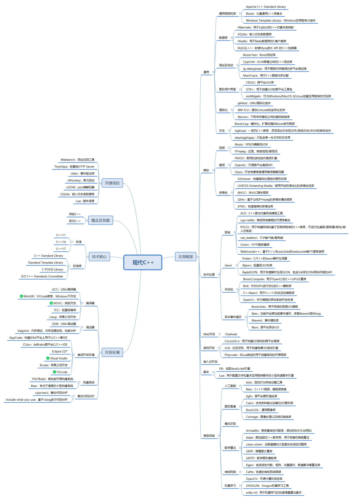

## 1. 综述

### 1.1 概念及发展

* 1998年，C++标准委员会发布了C++语言的第一个国际标准，也就是我们现在使用的最多的C++98；
* 2003年，标准委员会针对98版本中存在的诸多问题进行了修订，修订后发布了C++03；
* 2005年，C++标准委员会发布了一份技术报告，详细说明了引入C++新特性的计划。因为当时预计会在本世纪第一个十年的某个时间发布，这个新标准被非正式地命名为C++0x。但是，这个标准最终在2011年才面世，也就是C++11，此次标准为C++98发布后13年来的第一次重大修正；
* 2014年，标准委员会公布了C++14标准；
* 2017年，标准委员会计划即将公布的C++17标准； 
* 从C++11开始，我们都称之为现代C++。在C++通过演变来发展其定义的过程中，偶尔引发过与现有代码的兼容问题，不过根据Bjarne Stroustrup表示，新的标准将几乎100%兼容于现有标准。

###  1.2 现代 C++生态：

