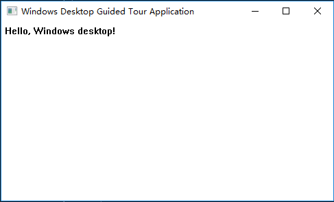
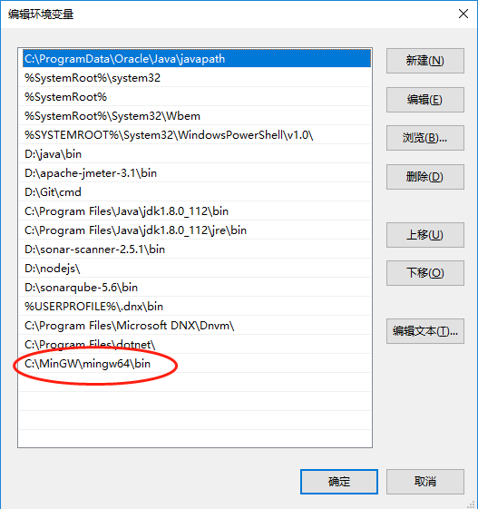
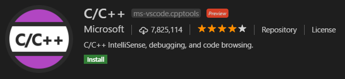
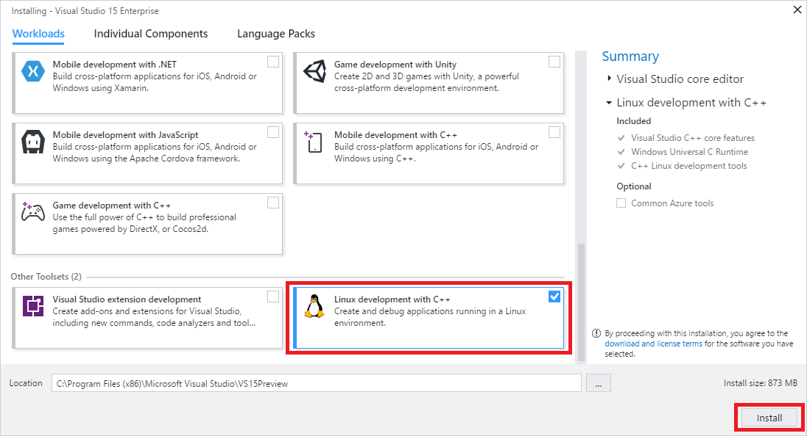
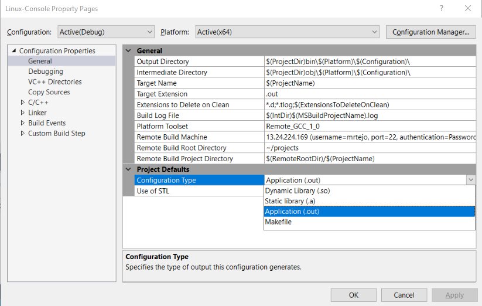
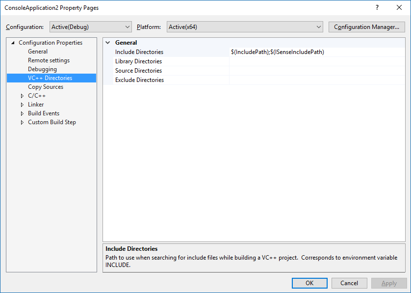
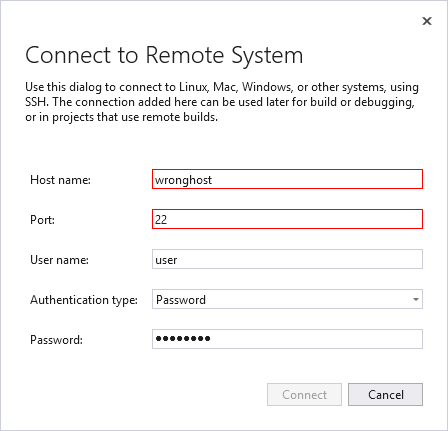
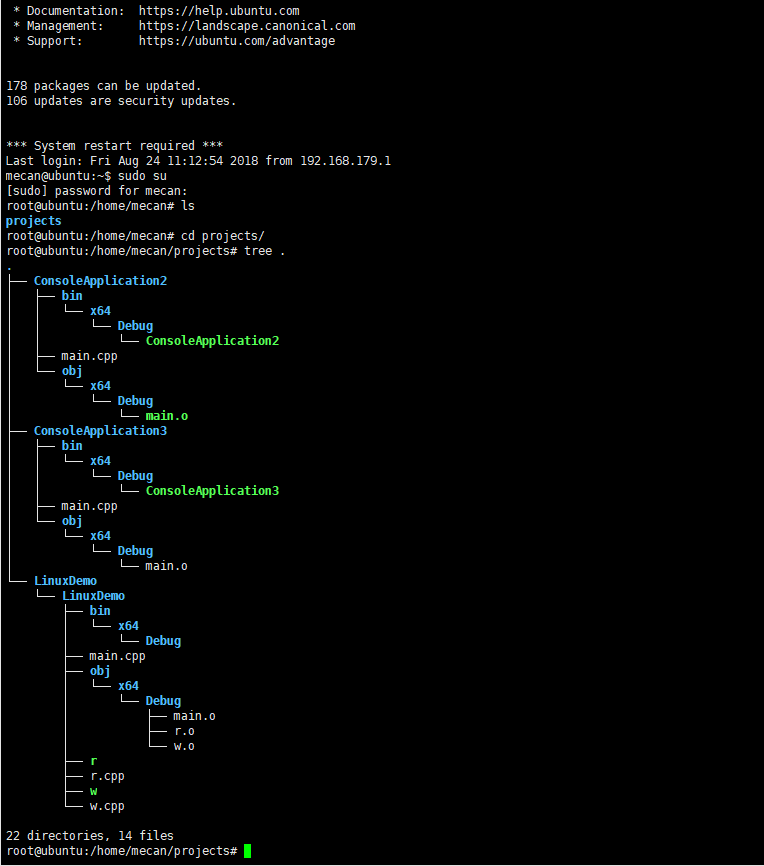

## 2. Windows 下的 Visual C++

### 2.1 Visual Studio 2017 中的 Visual C++

#### 2.1.1 概述

- 1）基本概念： Microsoft Visual C++（通常缩写为 Visual C++ 或 MSVC）是 Windows Visual Studio 的一部分，指 C++、C 和汇编语言开发的工具和库。 这些工具和库可用于创建通用 Windows 平台 (UWP) 应用、本机桌面和服务器应用程序、在 Windows、Linux、Android 和 iOS 上运行的跨平台库和应用以及使用 .NET Framework 的托管应用。 从 Windows 桌面的简单控制台应用到最复杂的应用，从移动设备的设备驱动程序和操作系统组件到跨平台游戏，再从 Azure 云中的最小 IoT 设备到多服务器的高性能计算等所有内容都可以使用 Visual C++ 编写。

- 2）Visual Studio 2017 向 Visual C++ 环境引入了许多更新和修补程序，其中包括：

  - [C++编译器](https://docs.microsoft.com/zh-cn/cpp/what-s-new-for-visual-cpp-in-visual-studio#c-compiler)
  - [C++ 标准库改进](https://docs.microsoft.com/zh-cn/cpp/what-s-new-for-visual-cpp-in-visual-studio#c-standard-library-improvements)
  - [其他库](https://docs.microsoft.com/zh-cn/cpp/what-s-new-for-visual-cpp-in-visual-studio#other-libraries)
  - [C++IDE](https://docs.microsoft.com/zh-cn/cpp/what-s-new-for-visual-cpp-in-visual-studio#c-ide)
  - [IntelliSense](https://docs.microsoft.com/zh-cn/cpp/what-s-new-for-visual-cpp-in-visual-studio#intellisense)
  - [包含“打开文件夹”的非 MSBuild 项目](https://docs.microsoft.com/zh-cn/cpp/what-s-new-for-visual-cpp-in-visual-studio#non-msbuild-projects-with-open-folder)
  - [通过“打开文件夹”支持 CMake](https://docs.microsoft.com/zh-cn/cpp/what-s-new-for-visual-cpp-in-visual-studio#cmake-support-via-open-folder)
  - [Windows 桌面开发](https://docs.microsoft.com/zh-cn/cpp/what-s-new-for-visual-cpp-in-visual-studio#windows-desktop-development-with-c)
  - [Linux 开发](https://docs.microsoft.com/zh-cn/cpp/what-s-new-for-visual-cpp-in-visual-studio#linux-development-with-c)
  - [游戏开发](https://docs.microsoft.com/zh-cn/cpp/what-s-new-for-visual-cpp-in-visual-studio#game-development-with-c)
  - [移动开发](https://docs.microsoft.com/zh-cn/cpp/what-s-new-for-visual-cpp-in-visual-studio#mobile-development-with-c-android-and-ios)
  - [Windows 应用](https://docs.microsoft.com/zh-cn/cpp/what-s-new-for-visual-cpp-in-visual-studio#universal-windows-apps)
  - [通用 Windows 平台（UWP）上的新选项](https://docs.microsoft.com/zh-cn/cpp/what-s-new-for-visual-cpp-in-visual-studio#new-options-for-c-on-universal-windows-platform-uwp)
  - [Clang/C2 平台工具集](https://docs.microsoft.com/zh-cn/cpp/what-s-new-for-visual-cpp-in-visual-studio#clangc2-platform-toolset)
  - [代码分析](https://docs.microsoft.com/zh-cn/cpp/what-s-new-for-visual-cpp-in-visual-studio#c-code-analysis)
  - [单元测试](https://docs.microsoft.com/zh-cn/cpp/what-s-new-for-visual-cpp-in-visual-studio#unit-testing)
  - [Visual Studio 图形诊断](https://docs.microsoft.com/zh-cn/cpp/what-s-new-for-visual-cpp-in-visual-studio#visual-studio-graphics-diagnostics)

- 3）一致性改进

  - [C++ conformance improvements in Visual Studio 2017](https://docs.microsoft.com/zh-cn/cpp/cpp-conformance-improvements-2017)
  - [Visual C++ Language Conformance](https://docs.microsoft.com/zh-cn/cpp/visual-cpp-language-conformance)

- 4）支持的平台
  - [Supported Platforms (Visual C++)](https://docs.microsoft.com/zh-cn/cpp/supported-platforms-visual-cpp)

#### 2.1.2 快速开始教程

- 1）系统必备

  - 宽带连接，满足 Visual Studio 安装程序可以下载数千兆字节的数据。
  - 运行 Microsoft Windows 7 或更高版本的计算机，建议获取最佳开发体验的 Windows 10， 请确保先安装 Visual Studio 最新的更新应用于您的系统。
  - 足够的可用磁盘空间，Visual Studio 需要至少为 7 GB 的磁盘空间，可能需要 50 GB 或更多，如果安装了许多常见选项， 我们建议将其安装在 c： 驱动器。

- 2）安装

  - 下载 Windows 的最新[Visual Studio 2017 安装程序](https://visualstudio.microsoft.com/downloads/?utm_medium=microsoft&utm_source=docs.microsoft.com&utm_campaign=button+cta&utm_content=download+vs2017)。
  - 找到你下载并运行它的安装程序文件。 它可能会显示在浏览器中，或在 Downloads 文件夹中可能会发现。 安装程序需要管理员特权才能运行。 你可能会看到用户帐户控制对话框，要求将由安装程序对您的系统进行更改; 选择权限授予是。 如果遇到问题，在文件资源管理器中查找下载的文件、 右键单击该安装程序图标，并选择以管理员身份运行从上下文菜单。
  - 安装程序提供工作负载列表，即一组用于特定开发领域的相关选项，确保安装`C++桌面开发`功能。 对 c + + 支持现在是默认情况下不安装的可选工作负荷的一部分。
  
    
  
  - 安装完成后，选择启动按钮以启动 Visual Studio。首次运行 Visual Studio 中，需要使用 Microsoft 帐户登录。 如果你没有帐户，则可以免费创建一个。 此外必须选择一个主题。 别担心，可以在如果要以后更改。它可能需要 Visual Studio 几分钟时间来获取准备好使用第一次你运行它。再次运行时，Visual Studio 的启动速度快得多。
  - 当运行 Visual Studio 时，已准备好继续下一步。

- 3）创建 C++控制台程序

  - 创建应用程序项目

    - Visual Studio 使用项目来组织应用的代码，使用解决方案来组织项目。 项目包含所有选项、 配置和规则用于生成你的应用，并管理所有项目文件和任何外部文件之间的关系。 若要创建您的应用程序，首先，你将创建新项目和解决方案。
    - 在 Visual Studio 中，打开`文件`菜单，然后选择`新建 > 项目`以打开`新项目`对话框。
    - 在`新项目`对话框中，选择`已安装`， Visual c + + 如果它未连接，请选中，然后选择`空项目`模板。 在`名称`字段中，输入 HelloWorld。 选择`确定`以创建该项目。
    - Visual Studio 创建新的空项目，并且可供您特别指明你想要创建并添加你的源代码文件的应用程序的类型。 你将执行该下一步。

  - 创建项目为控制台应用程序

    - Visual Studio 可以创建用于 Windows 和其他平台的所有类型的应用程序和组件。 `空项目`模板并不特定有关创建哪种类型的应用程序。 若要创建控制台应用程序、 一个运行在控制台或命令提示符窗口中，你必须告知 Visual Studio 生成应用程序为使用控制台子系统。
    - 在 Visual Studio 中，打开`项目`菜单，然后选择`属性`以打开`HelloWorld 属性页`对话框。
    - 在`属性页`对话框下`配置属性`，选择`链接器`，`系统`，然后选择编辑框旁边`子系统`属性。 在下拉列表中显示的菜单中，选择`控制台 (/ 子系统： 控制台)`。 选择`确定`以保存所做的更改。
    - Visual Studio 现在知道生成项目以在控制台窗口中运行。 接下来，将添加一个源代码文件，并为你的应用中输入的代码。

  - 添加一个源代码文件

    - 在`解决方案资源管理器`，选择 HelloWorld 项目。 在菜单栏上，选择`项目`，`添加新项`以打开`添加新项`对话框。
    - 在`添加新项`对话框中，选择`Visual c + + 下已安装`如果已选中。 在中心窗格中，选择`c + + 文件 (.cpp)`。 更改`名称`到 HelloWorld.cpp。 选择`添加`以关闭对话框并创建该文件。
    - Visual studio 创建新的空代码文件，并将其打开在编辑器窗口中，可以输入你的源代码。

  - 将代码添加到源文件

    - 将此代码复制到 HelloWorld.cpp 编辑器窗口。

    ```c++
     #include <iostream>

     int main()
     {
       std::cout << "Hello, world!" << std::endl;
       return 0;
     }
    ```

  - [故障排除指南](https://docs.microsoft.com/zh-cn/cpp/build/vscpp-step-1-create#troubleshooting-guide)

- 4）生成并运行的 c + + 控制台应用程序项目

  - 生成并运行 Visual Studio 中的代码

    - 若要生成项目时，选择生成解决方案从生成菜单。 输出窗口演示生成过程的结果。
    - 若要运行这些代码，在菜单栏上，选择调试，启动而不调试。
    - 控制台窗口将打开并运行你的应用程序。 Visual Studio 中启动控制台应用程序时，它运行你的代码，然后打印"按任意键继续。 . ." 从而使你有机会以查看输出。
    - 你已创建你的第一个"Hello，world ！" Visual Studio 中的控制台应用程序 ！ 按某个键，以关闭控制台窗口并返回到 Visual Studio。

  - 在命令窗口中运行你的代码

    - 在解决方案资源管理器、 选择 HelloWorld 解决方案，然后右键单击以打开上下文菜单。 选择在文件资源管理器中打开文件夹以打开文件资源管理器 HelloWorld 解决方案文件夹中的窗口。
    - 在文件资源管理器窗口中，打开的调试文件夹。 这包括你的应用程序、 HelloWorld.exe 和几个其他调试文件。 选择 HelloWorld.exe，请按住 Shift 键然后右键单击以打开上下文菜单。 选择复制路径为将路径复制到你的应用到剪贴板。
    - 若要打开命令提示符窗口，请按 Windows-R，打开运行对话框。 输入 cmd.exe 中打开文本框中，然后选择确定运行的命令提示符窗口。
    - 在命令提示符窗口中，右键单击要将你的应用程序的路径粘贴到命令提示符处。 按 enter 键以运行你的应用。
    - 你已生成，Visual Studio 中运行控制台应用程序 ！

  - [故障排除指南](https://docs.microsoft.com/zh-cn/cpp/build/vscpp-step-2-build#troubleshooting-guide)

- 5）创建 C++ Windows 桌面项目

  - 创建 Windows 桌面程序

    - 在“文件”菜单上选择“新建”，再选择“项目”。
    - 在`新的项目`对话框中，在左窗格中，展开`已安装 > Visual c + +`，然后选择`Windows 桌面`，选择`Windows 桌面向导`。
    - 在`Windows 桌面项目`对话框下`应用程序类型`，选择`Windows 应用程序 (.exe)`。 在“附加选项” 下，选择“空项目” 。 选择`确定`创建项目。
    - 在`解决方案资源管理器`中，右键单击项目名称，选择`添加`，然后选择`新项`。
    - 在“添加新项” 对话框中选择“C++ 文件(.cpp)” 。 在`名称`框中，例如，键入文件的名称`HelloWindowsDesktop.cpp`。 选择“添加”。
    - 现已创建你的项目，在编辑器中打开源文件。
    - 删除输入中的任何代码，在`HelloWindowsDesktop.cpp`编辑器中。 复制此代码示例并将其粘贴到 `HelloWindowsDesktop.cpp`:

    ```c++
    // HelloWindowsDesktop.cpp
    // compile with: /D_UNICODE /DUNICODE /DWIN32 /D_WINDOWS /c

    #include <windows.h>
    #include <stdlib.h>
    #include <string.h>
    #include <tchar.h>

    // Global variables

    // The main window class name.
    static TCHAR szWindowClass[] = _T("DesktopApp");

    // The string that appears in the application's title bar.
    static TCHAR szTitle[] = _T("Windows Desktop Guided Tour Application");

    HINSTANCE hInst;

    // Forward declarations of functions included in this code module:
    LRESULT CALLBACK WndProc(HWND, UINT, WPARAM, LPARAM);

    int CALLBACK WinMain(
      _In_ HINSTANCE hInstance,
      _In_ HINSTANCE hPrevInstance,
      _In_ LPSTR     lpCmdLine,
      _In_ int       nCmdShow
    )
    {
      WNDCLASSEX wcex;

      wcex.cbSize = sizeof(WNDCLASSEX);
      wcex.style          = CS_HREDRAW | CS_VREDRAW;
      wcex.lpfnWndProc    = WndProc;
      wcex.cbClsExtra     = 0;
      wcex.cbWndExtra     = 0;
      wcex.hInstance      = hInstance;
      wcex.hIcon          = LoadIcon(hInstance, IDI_APPLICATION);
      wcex.hCursor        = LoadCursor(NULL, IDC_ARROW);
      wcex.hbrBackground  = (HBRUSH)(COLOR_WINDOW+1);
      wcex.lpszMenuName   = NULL;
      wcex.lpszClassName  = szWindowClass;
      wcex.hIconSm        = LoadIcon(wcex.hInstance, IDI_APPLICATION);

      if (!RegisterClassEx(&wcex))
      {
          MessageBox(NULL,
            _T("Call to RegisterClassEx failed!"),
            _T("Windows Desktop Guided Tour"),
            NULL);

          return 1;
      }

      // Store instance handle in our global variable
      hInst = hInstance;

      // The parameters to CreateWindow explained:
      // szWindowClass: the name of the application
      // szTitle: the text that appears in the title bar
      // WS_OVERLAPPEDWINDOW: the type of window to create
      // CW_USEDEFAULT, CW_USEDEFAULT: initial position (x, y)
      // 500, 100: initial size (width, length)
      // NULL: the parent of this window
      // NULL: this application does not have a menu bar
      // hInstance: the first parameter from WinMain
      // NULL: not used in this application
      HWND hWnd = CreateWindow(
          szWindowClass,
          szTitle,
          WS_OVERLAPPEDWINDOW,
          CW_USEDEFAULT, CW_USEDEFAULT,
          500, 100,
          NULL,
          NULL,
          hInstance,
          NULL
      );

      if (!hWnd)
      {
          MessageBox(NULL,
            _T("Call to CreateWindow failed!"),
            _T("Windows Desktop Guided Tour"),
            NULL);

          return 1;
      }

      // The parameters to ShowWindow explained:
      // hWnd: the value returned from CreateWindow
      // nCmdShow: the fourth parameter from WinMain
      ShowWindow(hWnd,
          nCmdShow);
      UpdateWindow(hWnd);

      // Main message loop:
      MSG msg;
      while (GetMessage(&msg, NULL, 0, 0))
      {
          TranslateMessage(&msg);
          DispatchMessage(&msg);
      }

      return (int) msg.wParam;
    }

    //  FUNCTION: WndProc(HWND, UINT, WPARAM, LPARAM)
    //
    //  PURPOSE:  Processes messages for the main window.
    //
    //  WM_PAINT    - Paint the main window
    //  WM_DESTROY  - post a quit message and return
    LRESULT CALLBACK WndProc(HWND hWnd, UINT message, WPARAM wParam, LPARAM lParam)
    {
      PAINTSTRUCT ps;
      HDC hdc;
      TCHAR greeting[] = _T("Hello, Windows desktop!");

      switch (message)
      {
      case WM_PAINT:
          hdc = BeginPaint(hWnd, &ps);

          // Here your application is laid out.
          // For this introduction, we just print out "Hello, Windows desktop!"
          // in the top left corner.
          TextOut(hdc,
            5, 5,
            greeting, _tcslen(greeting));
          // End application-specific layout section.

          EndPaint(hWnd, &ps);
          break;
      case WM_DESTROY:
          PostQuitMessage(0);
          break;
      default:
          return DefWindowProc(hWnd, message, wParam, lParam);
          break;
      }

      return 0;
    }
    ```

    - 在 “生成” 菜单上，选择 “生成解决方案”。 编译的结果应出现在 Visual Studio `输出`窗口中的。
    - 若要运行该应用程序，按 F5。 一个窗口，其中包含文本"Hello，Windows 桌面 ！" 文字的窗口。

    

    - 请参阅[Windows 桌面应用程序 (C++)](https://docs.microsoft.com/zh-cn/cpp/windows/windows-desktop-applications-cpp)

### 2.2 VS Code 中的 C/C++

#### 2.2.1 环境搭建

1. C/C++编译器下载：[mingw-w64](http://www.mingw-w64.org/)
2. 配置 mingw-w64 环境变量：

    

3. 安装 VSCode 的 C/C++插件：

    

#### 2.2.2 编译调试运行

1. 配置编译调试环境

- 打开工作文件夹根目录中`.vscode`文件夹，配置 launch.json 文件：

    ```json
    {
    "version": "0.2.0",
    "configurations": [
      {
        "name": "(Windows) Launch",
        "type": "cppdbg",
        "request": "launch",
        "program": "${workspaceFolder}/helloworld.exe",
        "args": [],
        "stopAtEntry": false,
        "cwd": "${workspaceFolder}",
        "environment": [],
        "externalConsole": true,
        "MIMode": "gdb",
        "miDebuggerPath": "C:\\MinGW\\mingw64\\bin\\gdb.exe",
        "setupCommands": [
          {
            "description": "Enable pretty-printing for gdb",
            "text": "-enable-pretty-printing",
            "ignoreFailures": true
          }
        ],
        "preLaunchTask": "build hello world"
      }
    ]
    }
    ```

- 配置 IntelliSense，运行`C/Cpp: Edit configurations...`命令（`Ctrl+Shift+P`）,在.vscode 文件夹下会生成`c_cpp_properties.json`文件，添加以下内容：

    ```json
    {
    "configurations": [
      {
        "name": "Win32",
        "browse": {
          "path": ["${workspaceFolder}"],
          "limitSymbolsToIncludedHeaders": true
        },
        "includePath": ["${workspaceFolder}"],
        "defines": ["_DEBUG", "UNICODE", "_UNICODE"],
        "compilerPath": "C:\\MinGW\\mingw64\\bin\\gcc.exe",
        "cStandard": "c11",
        "cppStandard": "c++17",
        "intelliSenseMode": "clang-x64"
      }
    ],
    "version": 4
    }
    ```

- 构建代码，运行`Tasks: Configure Tasks...`命令（`Ctrl+Shift+P`），`使用模板创建->其他`，在.vscode 文件夹下会生成`tasks.json`文件，添加以下内容：

    ```json
    {
    "version": "2.0.0",
    "tasks": [
      {
        "label": "build hello world",
        "type": "shell",
        "command": "g++"，
        "args": ["-g", "helloworld.cpp", "-o", "helloworld"],
        "group": {
          "kind": "build",
          "isDefault": true
        }
      }
    ]
    }
    ```

- 在工作文件夹根目录新建`helloworld.cpp`文件，添加以下内容：

    ```C++
    #include <iostream>
    #include <windows.h>
    #include <vector>
    #include <stdlib.h>
    using namespace std;

    int main() {
        cout << "gsafety, I love you!" << endl;
        vector<int> a;
        a.push_back(5);
        cout << a[0] << endl;
        system("pause");
        return 0;
    }
    ```

2. 调试运行

- 打开 VSCode 调试面板，配置调试，选择`Windows Debugging with GDB.`;

- 运行调试，调试控制台输出以下内容：

    ```
    =thread-group-added,id="i1"
    GNU gdb (GDB) 7.8
    Copyright (C) 2014 Free Software Foundation, Inc.
    License GPLv3+: GNU GPL version 3 or later <http://gnu.org/licenses/gpl.html>
    This is free software: you are free to change and redistribute it.
    There is NO WARRANTY, to the extent permitted by law.  Type "show copying"
    and "show warranty" for details.
    This GDB was configured as "x86_64-w64-mingw32".
    Type "show configuration" for configuration details.
    For bug reporting instructions, please see:
    <http://www.gnu.org/software/gdb/bugs/>.
    Find the GDB manual and other documentation resources online at:
    <http://www.gnu.org/software/gdb/documentation/>.
    For help, type "help".
    Type "apropos word" to search for commands related to "word".
    =cmd-param-changed,param="pagination",value="off"
    ```

- 终端显示以下内容：

    ```
    > Executing task: g++ -g helloworld.cpp <

    终端将被任务重用，按任意键关闭。
    ```

- 控制台显示：

    ```
    gsafety, I love you!
    5
    请按任意键继续. . .
    ```

- 调试成功！请参阅[C/C++ for VS Code (Preview)](https://code.visualstudio.com/docs/languages/cpp)

### 2.3 使用 Visual Studio 2017 连接到远程 Linux 调试 C/C++项目

#### 2.3.1 部署 Linux 开发工作负载

- Visual Studio 安装程序

  - 若要使用 Visual Studio IDE 创建和调试针对 Linux 的 C++ 项目，必须安装使用 C++ 的 Linux 开发工作负荷。
  - 启动 Visual Studio 安装程序并选择“使用 C++ 的 Linux 开发”工作负载。

    

  - 单击“安装”以继续进行安装。

- Linux(ubuntu-17.10-server) 安装程序
  - 目标 Linux 计算机必须安装 openssh-server、g++、gdb 和 gdbserver，并且必须运行 ssh 守护程序。 如果这些尚不存在，则可以进行安装，如下所示：
  - 在 Linux 计算机上的 shell 提示符下，运行：
    ```
    sudo apt-get install openssh-server g++ gdb gdbserver
    ```
  - 通过运行以下命令，确保 ssh 服务在 Linux 计算机上运行：

    ```
    sudo service ssh start
    ```

    这将启动该服务并在后台运行它，准备接受连接。

#### 2.3.2 新建 Linux 项目

- 在 Visual Studio 中选择“文件 > 新建项目”，或按 `Ctrl + Shift + N`。
- 依次选择“Visual C++ > 跨平台 > Linux”节点，再选择要创建的项目类型，输入名称/位置，再单击“确定”。

#### 2.3.2 配置 Linux 项目

- 常规设置 - 可以使用 Visual Studio 为 Linux 项目配置各种选项。 若要查看这些选项，请选择“项目”>“属性”菜单，或在“解决方案资源管理器”中右键单击相应项目，然后从上下文菜单中选择“属性”。 显示“常规”设置。默认情况下，可执行文件 (.out) 是使用该工具生成的。 若要生成静态或动态库，或使用现有生成文件，请使用“配置类型”选项。
  
    

- 包含目录和 IntelliSense 支持，使用项目属性中的“VC++ 目录”项告诉 Visual Studio 在哪里可以找到包含文件。

    

#### 2.3.3 连接到远程 Linux 计算机

- 在 Visual Studio 中生成 C++ Linux 项目时，将 Linux 代码复制到远程 Linux 计算机，然后基于 Visual Studio 设置进行编译。 若要设置此远程连接，请执行以下操作：
- 首次生成项目或手动创建新条目的方法：选择“工具 > 选项”，然后打开“跨平台 > 连接管理器”节点，单击“添加”按钮。
- 在任一方案中，均将显示“连接到远程系统”窗口。
- 输入以下信息：

    |**条目**|**描述**|
    |:---|:---|
    |**主机名**|目标设备的名称或 IP 地址|
    |**端口**|运行 SSH 服务的端口，通常为 22|
    |**用户名**|要进行身份验证的用户|
    |**身份验证类型**|同时支持密码或私钥|
    |**密码**|输入的用户名的密码|
    |**私钥文件**|为 ssh 连接创建的私钥|

- 单击“连接”按钮，尝试连接到远程计算机。 如果连接失败，则需要更改的输入框将以红色标出。

    

#### 2.3.4 部署、调试、运行 Linux 项目

- 调试 Linux 项目
  - 在 Visual Studio 中创建 Linux C++ 项目，并使用 Linux 连接管理器连接到该项目，即可运行和调试该项目。 在远程目标上编译、执行和调试代码。
    与 Linux 项目交互并对其进行调试方法有若干种。
  - 使用 Visual Studio 传统功能（例如断点、监视窗口和悬停在变量上）进行调试。 使用这些方法，可以像平常调试其他项目类型那样进行调试。
  - 从特殊 Linux 控制台窗口中的目标计算机查看输出。 还可以使用控制台将输入发送到目标计算机。
  - 在“调试”属性页中选择调试模式。GDB 用于调试在 Linux 上运行的应用程序。 但是，能以两种不同的模式运行，可从项目“调试”属性页中的“调试模式”选项中进行选择：在“gdbserver”模式中，GDB 在本地运行，连接到在远程系统上运行的 gdbserver。 请注意，这是 Linux 控制台窗口唯一支持的模式。在“gdb”模式中，Visual Studio 调试器驱动远程系统上的 GDB，如果 GDB 的本地版本与目标计算机上安装的版本不兼容，则远程系统上的 GDB 更易兼容。
  - 使用 Visual Studio 中的标准“调试”工作栏，选择远程目标。远程目标可用时，将看见它按名称或 IP 地址列出。如果还未连接到远程目标，将会看见使用`Linux 连接管理器`连接到远程目标的说明。
  - 在已知将执行的某些代码的左滚动条槽中单击，设置断点。设置断点的代码行上出现一个红点。
  - 按 F5（或者“调试”>“开始调试”）开始调试。开始调试时，应用程序先在远程目标上编译，再启动。 任何编译错误都将显示在“错误列表”窗口中。如果没有错误，则应用将启动并且调试程序将在断点处暂停。现在，可以通过按命令键（如 F10 或 F11），与处于当前状态的应用程序交互、查看变量以及逐行执行代码。
  - 如果需要使用 Linux 控制台与应用进行交互，请选择“调试”>“Linux 控制台”。此控制台将显示来自目标计算机的全部控制台输出并接收输入，然后将其发送到目标计算机。
  - 在Linux系统的`/home/user/projects`文件夹下，可找到通过Visual Studio远程创建的工程文件。

    

  - 请参阅[部署、运行和调试 Linux 项目](https://docs.microsoft.com/zh-cn/cpp/linux/deploy-run-and-debug-your-linux-project)
