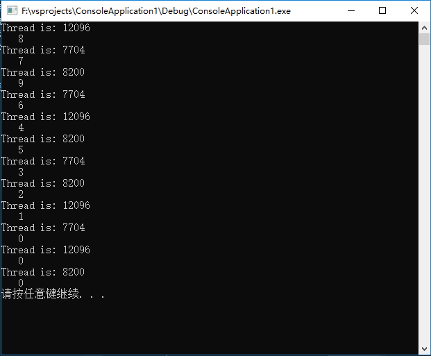

# 4. 演练：Visual C++示例程序

### 4.1 多线程

1. 实例程序简介

- 该多线程示例小程序旨在体现 C++11 标准的多线程特性`std::thread`
- 在队列中存入一定数量的数据后，通过一个或多个线程同时往队列中取出数据
- 涉及到线程的创建，加入以及`std::thread`类的部分方法

2. 实例详解

- 创建结构体保存临时数据：

  ```c++
  typedef struct task_tag
  {
    int data;
    task_tag(int i) : data(i) { }
  } Task, *PTask;
  ```

- 消息队列的数据存入与取出操作：

  ```c++
  //数据入栈
  void PushTask(PTask pTask)
  {
      //为消息队列添加唯一互斥锁
      std::unique_lock<std::mutex> lock(m_queueMutex);
      m_queue.push(pTask);
      m_cond.notify_one();
  }

  PTask PopTask()
  {
      PTask pRtn = NULL;
      std::unique_lock<std::mutex> lock(m_queueMutex);
      while (m_queue.empty())
      {
          m_cond.wait_for(lock, std::chrono::seconds(1));
      }

      if (!m_queue.empty())
      {
          pRtn = m_queue.front();
          if (pRtn->data != 0)
              m_queue.pop();
      }

      return pRtn;
  }
  ```

- 线程函数：

  ```c++
  void thread_fun(MessageQueue *arguments) {
          while (true) {
          PTask data = arguments->PopTask();

          if (data != NULL) {
              //std::cout不支持多线程安全，故用printf函数打印
              printf("Thread is: %d\n", std::this_thread::get_id());
              printf("   %d\n", data->data);
              Sleep(500);
              if (0 == data->data) //当data为0，任务完毕，退出循环
                  break;
              else
                  delete data;
          }
      }
  ```

3. 源代码及运行结果

- 实例源码

    ```c++
    // ConsoleApplication1.cpp : 此文件包含 "main" 函数。程序执行将在此处开始并结束。
    //

    #include <iostream>
    #include <queue>
    #include <mutex>
    #include <thread>
    #include <chrono>
    #include <memory>
    #include <condition_variable>
    #include <Windows.h>

    typedef struct task_tag
    {
        int data;
        task_tag(int i) : data(i) { }
    } Task, *PTask;

    class MessageQueue {
    public:
        MessageQueue() {}
        ~MessageQueue()
        {
            if (!m_queue.empty())
            {
                PTask pRtn = m_queue.front();
                delete pRtn;
            }

        }

        void PushTask(PTask pTask)
        {
            std::unique_lock<std::mutex> lock(m_queueMutex);
            m_queue.push(pTask);
            m_cond.notify_one();
        }

        PTask PopTask()
        {
            PTask pRtn = NULL;
            std::unique_lock<std::mutex> lock(m_queueMutex);
            while (m_queue.empty())
            {
                m_cond.wait_for(lock, std::chrono::seconds(1));
            }

            if (!m_queue.empty())
            {
                pRtn = m_queue.front();
                if (pRtn->data != 0)
                    m_queue.pop();
            }

            return pRtn;
        }

    private:
        std::mutex m_queueMutex;
        std::condition_variable m_cond;
        std::queue<PTask> m_queue;
    };

        void thread_fun(MessageQueue *arguments) {
            while (true) {
            PTask data = arguments->PopTask();

            if (data != NULL) {
                printf("Thread is: %d\n", std::this_thread::get_id());
                printf("   %d\n", data->data);
                Sleep(500);
                if (0 == data->data) //Thread end.
                    break;
                else
                    delete data;
            }
        }

        return;
    }

    int main(int argc, char *argv[])
    {
        MessageQueue cq;

        #define THREAD_NUM 3
        std::thread threads[THREAD_NUM];

        for (int i = 0; i < THREAD_NUM; ++i) {
            threads[i] = std::thread(thread_fun, &cq);
        }

        int i = 10;
        while (i > 0)
        {
            Task *pTask = new Task(--i);
            cq.PushTask(pTask);
        }

        for (int i = 0; i < THREAD_NUM; ++i) {
            threads[i].join();
        }

        system("pause");
        return 0;
    }

    // 运行程序: Ctrl + F5 或调试 >“开始执行(不调试)”菜单
    // 调试程序: F5 或调试 >“开始调试”菜单

    // 入门提示:
    //   1. 使用解决方案资源管理器窗口添加/管理文件
    //   2. 使用团队资源管理器窗口连接到源代码管理
    //   3. 使用输出窗口查看生成输出和其他消息
    //   4. 使用错误列表窗口查看错误
    //   5. 转到“项目”>“添加新项”以创建新的代码文件，或转到“项目”>“添加现有项”以将现有代码文件添加到项目
    //   6. 将来，若要再次打开此项目，请转到“文件”>“打开”>“项目”并选择 .sln 文件
    ```

- 运行结果：

  

### 4.2 消息队列实现简单通讯

1. 程序简介：

* 在Linux环境下，利用消息队列实现简单通讯
* 两个C++程序，一个创建消息队列，并往里面传消息，另一个往消息队列里面取消息

2. 实例详解：

* 消息队列创建
    ```c++
    #define MSGKEY  1236        //键值

    struct msgbuf
    {
    long mtype;
    char mtext[100];
    };
    int msgid;//消息ID
    struct msgbuf buf;  //注意buf是结构体

    msgid = msgget(MSGKEY, IPC_CREAT | IPC_EXCL);   //创建消息队列
    if (-1 == msgid)     //创建失败返回-1
    {
    perror("msgget");
    exit(1);
    }
    ```

* 发送消息
    ```c++
    memset(&buf, 0, sizeof(buf));   //先清空缓冲区
    scanf("%s", buf.mtext);
    buf.mtype = 5;  //消息类型（发）为5，可任意设置，但必须与后面一致

    ret = msgsnd(msgid, &buf, sizeof(buf.mtext), 0);    //发送消息
    if (-1 == ret)  //发送失败
    {
    perror("msgsnd");
    exit(1);
    }
    if (!strncmp(buf.mtext, "bye", 3))  //以bye结束
    {
    /* 结束时通知父进程，要让四个进程全部死亡 */
    buf.mtype = 3;  //父进程（收）的消息类型
    ret = msgsnd(msgid, &buf, sizeof(buf.mtext), 0);//服进程接收消息
    if (-1 == ret)
    {
        perror("msgsnd");
        exit(1);
    }
    break;
    }
    ```

* 接收并输出消息
    ```c++
    memset(&buf, 0, sizeof(buf));

    ret = msgrcv(msgid, &buf, sizeof(buf.mtext), 3, 0);//父进程接收消息
    if (-1 == ret)
    {
    perror("msgrcv");
    exit(1);
    }
    if (!strncmp(buf.mtext, "bye", 3))  //以bye结束
    {
    kill(pid, SIGKILL);
    break;
    }
    printf("Receive : %s\n", buf.mtext);    //把收到的消息打印
    ```

* 整体代码：
    ```c++
    //两客户端代码一样，若消息栈被创建，会主动接受消息
    #include <cstdio>
    #include <unistd.h>
    
    #include <sys/types.h>
    #include <sys/wait.h>
    #include <sys/ipc.h>
    #include <sys/msg.h>
    #include <stdio.h>
    #include <stdlib.h>
    #include <string.h>
    #include <signal.h>
    ```


    #define MSGKEY  1236        //键值
    
    struct msgbuf
    {
        long mtype;
        char mtext[100];
    };
    
    int main()
    {
        int msgid;
        int ret;
        struct msgbuf buf;  //注意buf是结构体
        pid_t pid;
    
        msgid = msgget(MSGKEY, IPC_CREAT | IPC_EXCL);   //创建消息队列
        if (-1 == msgid)     //创建失败返回-1
        {
            perror("msgget");
            exit(1);
        }
    
        pid = fork();   //创建子进程，注意必须在创建消息队列之后
    
        if (-1 == pid)  //创建失败返回-1
        {
            perror("fork");
            exit(1);
        }
    
        else if (0 == pid)  //pid为0，则进入子进程
        {
            while (1)
            {
                memset(&buf, 0, sizeof(buf));   //先清空缓冲区
                scanf("%s", buf.mtext);
                buf.mtype = 5;  //消息类型（发）为5，可任意设置，但必须与后面一致
    
                ret = msgsnd(msgid, &buf, sizeof(buf.mtext), 0);    //发送消息
                if (-1 == ret)  //发送失败
                {
                    perror("msgsnd");
                    exit(1);
                }
                if (!strncmp(buf.mtext, "bye", 3))  //以bye结束
                {
                    /* 结束时通知父进程，要让四个进程全部死亡 */
                    buf.mtype = 3;  //父进程（收）的消息类型
                    ret = msgsnd(msgid, &buf, sizeof(buf.mtext), 0);//服进程接收消息
                    if (-1 == ret)
                    {
                        perror("msgsnd");
                        exit(1);
                    }
                    break;
                }
            }
        }
    
        else    //否则，进入父进程
        {
            while (1)
            {
                memset(&buf, 0, sizeof(buf));
    
                ret = msgrcv(msgid, &buf, sizeof(buf.mtext), 3, 0);//父进程接收消息
                if (-1 == ret)
                {
                    perror("msgrcv");
                    exit(1);
                }
                if (!strncmp(buf.mtext, "bye", 3))  //以bye结束
                {
                    kill(pid, SIGKILL);
                    break;
                }
                printf("Receive : %s\n", buf.mtext);    //把收到的消息打印
            }
            waitpid(pid, NULL, 0);  //父进程等待
        }
        msgctl(msgid, IPC_RMID, NULL);  //销毁消息队列
    
        return 0;
    }
    ```

- 运行结果：

  - 编译后，运行 Linux 的 C++程序，首先查看系统消息队列及内存共享情况：

  ```cmd
  root@ubuntu:/home/mecan/projects/ConsoleApplication2/obj/x64/Debug# ipcs

  ------ Message Queues --------
  key        msqid      owner      perms      used-bytes   messages
  0x000004d2 0          mecan      0          0            0
  0x000004d3 32769      mecan      0          0            0
  0x000004d4 98306      root       0          0            0

  ------ Shared Memory Segments --------
  key        shmid      owner      perms      bytes      nattch     status
  0x00000000 0          root       644        80         2
  0x00000000 32769      root       644        16384      2
  0x00000000 65538      root       644        280        2
  0x3c81b7f5 98307      mecan      666        4096       0

  ------ Semaphore Arrays --------
  key        semid      owner      perms      nsems
  0x000000a7 65536      root       600        1
  0x3c81b7f6 98305      mecan      666        1
  ```

  - 运行程序：

  ```cmd
  root@ubuntu:/home/mecan/projects/ConsoleApplication3/bin/x64/Debug# ./ConsoleApplication3
  root@ubuntu:/home/mecan/projects/ConsoleApplication3/bin/x64/Debug# ./ConsoleApplication3
  ```

  - 查看消息队列，多出一条：

  ```cmd
  root@ubuntu:/home/mecan/projects/ConsoleApplication2/bin/x64/Debug# ipcs -q

  ------ Message Queues --------
  key        msqid      owner      perms      used-bytes   messages
  0x000004d2 0          mecan      0          0            0
  0x000004d3 32769      mecan      0          0            0
  0x000004d4 98306      root       0          0            0
  0x0000007b 131075     root       0          0            0
  ```

  - Linux 控制台程序间收发消息：

  ```
  root@ubuntu:/home/mecan/projects/ConsoleApplication3/bin/x64/Debug#
  mecan //ConsoleApplication3
  Receive : mecan //ConsoleApplication2
  gsafety //ConsoleApplication2
  Receive : gsafety //ConsoleApplication3
  ```
