## 5. Linux下的C++ IDE

### 5.1 Visual Studio Code

Visual Studio Code [主页]([https://www.visualstudio.com](https://www.visualstudio.com/) )

Visual Studio 是一个功能丰富的、完全整合的、跨平台开发环境，运行在 Linux、Windows 和 Mac OS X 上。 最近它向 Linux 用户开源了，它重新定义了代码编辑这件事，为用户提供了在 Windows、Android、iOS 和 Web 等多个平台开发不同应用所需的一切工具。

它功能完备，功能分类为应用程序开发、应用生命周期管理、扩展和集成特性。你可以从 Visual Studio 官网阅读全面的功能列表。

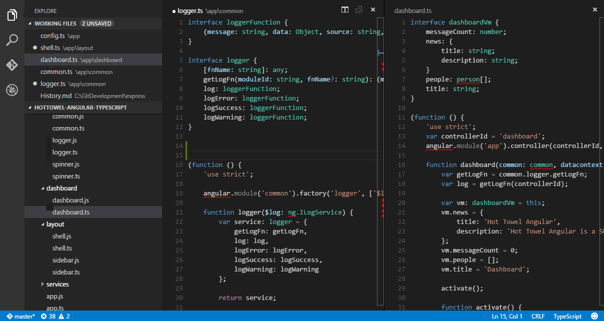

### 5.2 JetBrains CLion

JetBrains CLion [主页]( https://www.jetbrains.com/clion/) 

JetBrains CLion 是一个收费的、强大的跨平台 C/C++ IDE。它是一个完全整合的 C/C++ 程序开发环境，并提供 Cmake 项目模型、一个嵌入式终端窗口和一个主要以键盘操作的编码环境。

它还提供了一个智能而现代化的编辑器，具有许多令人激动的功能，提供了理想的编码环境，这些功能包括：

* 除了 C/C++ 还支持其他多种语言
* 在符号声明和上下文中轻松导航
* 代码生成和重构
* 可定制的编辑器
* 即时代码分析
* 集成的代码调试器
* 支持 Git、Subversion、Mercurial、CVS、Perforcevia（通过插件）和 TFS
* 无缝集成了 Google 测试框架
* 通过 Vim 仿真插件支持 Vim 编辑体验

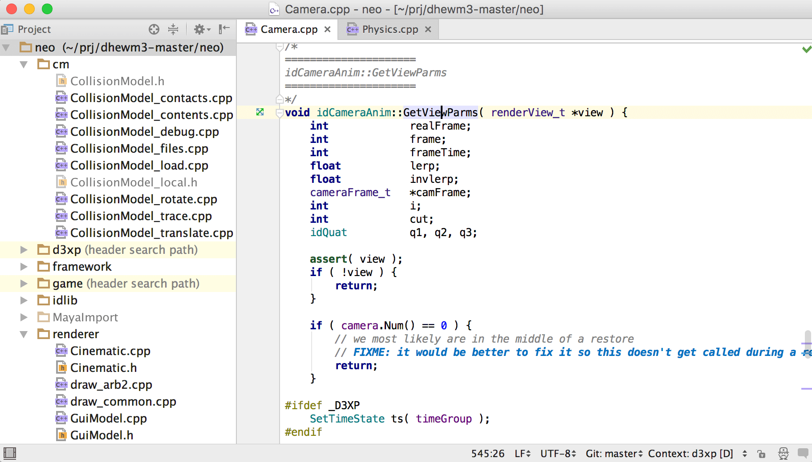

### 5.3 Eclipse CDT (C/C++ Development Tooling)

Eclipse CDT[主页](http://www.eclipse.org/cdt/)

Eclipse 在编程界是一款著名的、开源的、跨平台的 IDE。它给用户提供了一个很棒的界面，并支持拖拽功能以方便界面元素的布置。

Eclipse CDT 是一个基于 Eclipse 主平台的项目，它提供了一个完整功能的 C/C++ IDE，并具有以下功能：

* 支持项目创建
* 管理各种工具链的构建
* 标准的 make 构建
* 源代码导航
* 一些知识工具，如调用图、类型分级结构，内置浏览器，宏定义浏览器
* 支持语法高亮的代码编辑器
* 支持代码折叠和超链接导航
* 代码重构与代码生成
* 可视化调试存储器、寄存器的工具
* 反汇编查看器以及更多功能

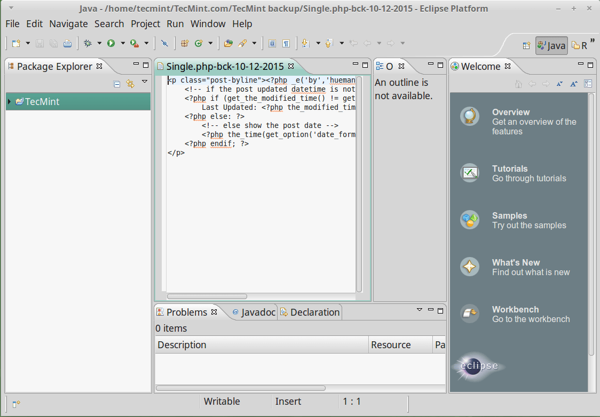

### 5.4 CodeLite IDE

CodeLite [主页](http://codelite.org/)

CodeLite 也是一款为 C/C++、JavaScript（Node.js）和 PHP 编程专门设计打造的自由而开源的、跨平台的 IDE。

它的一些主要特点包括：

* 代码补完，提供了两个代码补完引擎
* 支持多种编译器，包括 GCC、clang/VC++
* 以代码词汇的方式显示错误
* 构建选项卡中的错误消息可点击
* 支持下一代 LLDB 调试器
* 支持 GDB
* 支持重构
* 代码导航
* 使用内置的 SFTP 进行远程开发
* 源代码控制插件
* 开发基于 wxWidgets 应用的 RAD（快速应用程序开发）工具，以及更多的特性

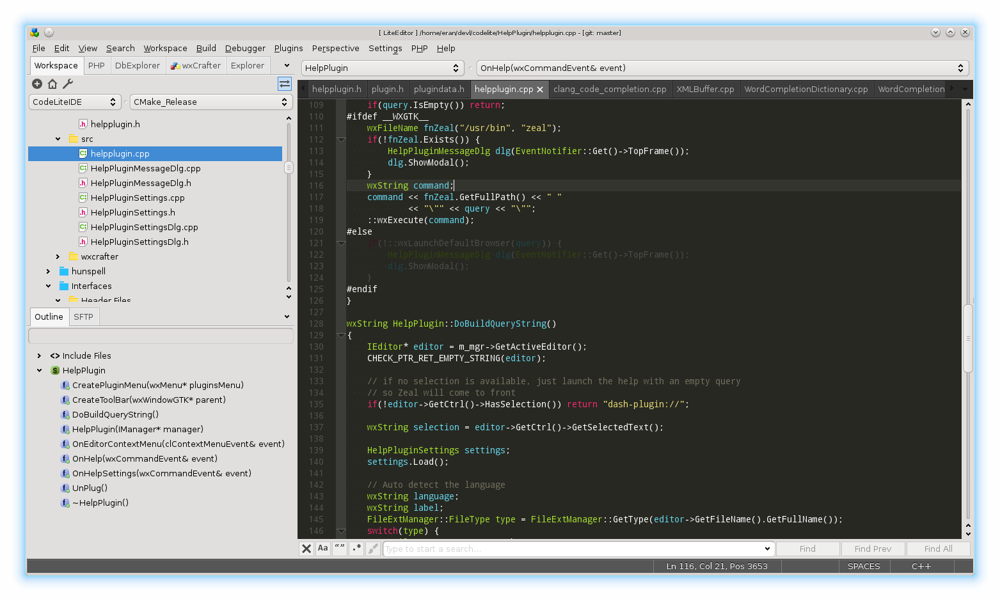

### 5.5 Code::Blocks

Code::Blocks [主页](http://www.codeblocks.org)

Code::Blocks 是一个免费的、具有高度扩展性的、并且可以配置的跨平台 C++ IDE，它为用户提供了必备而典范的功能。它具有一致的界面和体验。

最重要的是，你可以通过用户开发的插件扩展它的功能，一些插件是随同 Code::Blocks 发布的，而另外一些则不是，它们由 Code::Block 开发团队之外的个人用户所编写的。

其功能分为编译器、调试器、界面功能，它们包括：

* 支持多种编译器如　GCC、clang、Borland C++ 5.5、digital mars 等等
* 非常快，不需要 makefile
* 支持多个目标平台的项目
* 支持将项目组合起来的工作空间
* GNU GDB 接口
* 支持完整的断点功能，包括代码断点，数据断点，断点条件等等
* 显示本地函数的符号和参数
* 用户内存导出和语法高亮显示
* 可自定义、可扩展的界面以及许多其他的的功能，包括那些用户开发的插件添加功能

### 5.6 用于 C/C++ 开发的 Netbeans

Netbeans [主页](https://netbeans.org/features/cpp/index.html)

Netbeans 是一个自由而开源的、流行的跨平台 IDE ，可用于 C/C++ 以及其他编程语言，可以使用由社区开发的插件展现了其完全的扩展性。

它包含了用于 C/C++ 开发的项目类型和模版，并且你可以使用静态和动态函数库来构建应用程序。此外，你可以利用现有的代码去创造你的工程，并且也可以通过拖放的方式导入二进制文件来从头构建应用。

让我们来看看关于它的特性：

* C/C++ 编辑器很好的整合了多线程的 [GNU GDB 调试工具](http://www.tecmint.com/debug*source*code*in*linux*using*gdb/)
* 支持代码协助
* 支持 C++11 标准
* 在里面创建和运行 C/C++ 测试程序
* 支持　QT　工具包
* 支持将已编译的应用程序自动打包到 .tar，.zip 等归档文件
* 支持多个编译器，例如： GNU、Clang/LLVM、Cygwin、Oracle Solaris Studio 和 MinGW
* 支持远程开发
* 文件导航
* 源代码检查

### 5.7 Bluefish 编辑器

Bluefish [主页](http://bluefish.openoffice.nl )

Bluefish 不仅仅是一个一般的编辑器，它是一个轻量级的、快捷的编辑器，为程序员提供了如开发网站、编写脚本和软件代码的 IDE 特性。它支持多平台，可以在 Linux、Mac OSX、FreeBSD、OpenBSD、Solaris 和 Windows 上运行，同时支持包括 C/C++ 在内的众多编程语言。

下面列出的是它众多功能的一部分：

* 多文档界面
* 支持递归打开文件，基于文件名通配模式或者内容模式
* 提供一个非常强大的搜索和替换功能
* 代码片段边栏
* 支持整合个人的外部过滤器，可使用命令如 awk，sed，sort 以及自定义构建脚本组成（过滤器的）管道文件
* 支持全屏编辑
* 网站上传和下载
* 支持多种编码等许多其他功能

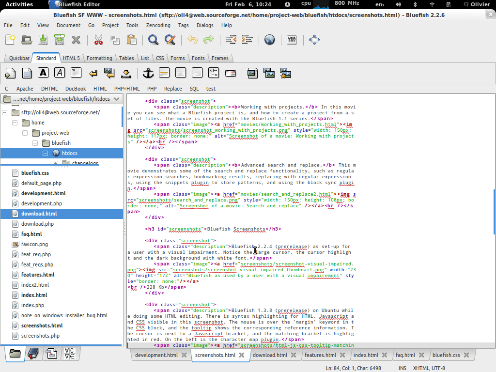

### 5.8 Brackets 代码编辑器

Brackets [主页](http://brackets.io/)

Brackets 是一个现代化风格的、开源的文本编辑器，专为 Web 设计与开发打造。它可以通过插件进行高度扩展，因此 C/C++ 程序员通过安装 C/C++/Objective*C 包来使用它来开发，这个包用来在辅助 C/C++ 代码编写的同时提供了 IDE 之类的特性。

### 5.9 Atom 代码编辑器

Atom [主页](https://atom.io/)

Atom [安装指南](http://www.tecmint.com/atom*text*and*source*code*editor*for*linux/)

Atom 也是一个现代化风格、开源的多平台文本编辑器，它能运行在 Linux、Windows 或是 Mac OS X 平台。它的定制可深入底层，用户可以自定义它，以便满足各种编写代码的需求。

它功能完整，主要的功能包括：

* 内置了包管理器
* 智能的自动补完
* 内置文件浏览器
* 查找、替换以及其他更多的功能

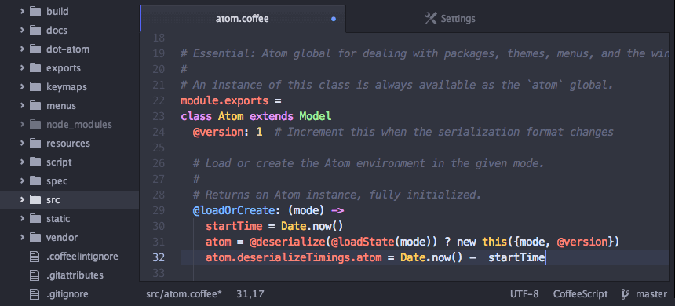

### 5.10 Sublime Text 编辑器

Sublime Text [主页](https://www.sublimetext.com)

Sublime Text [安装指南](http://www.tecmint.com/install*sublime*text*editor*in*linux/)

Sublime Text 是一个完善的、跨平台的文本编辑器，可用于代码、标记语言和一般文字。它可以用来编写 C/C++ 代码，并且提供了非常棒的用户界面。

它的功能列表包括：

* 多重选择
* 按模式搜索命令
* 抵达任何一处的功能
* 免打扰模式
* 窗口分割
* 支持项目之间快速的切换
* 高度可定制
* 支持基于 Python 的 API 插件以及其他特性

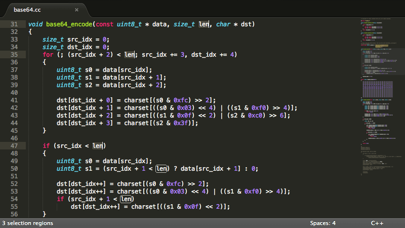

### 5.11 KDevelop

KDevelop [主页](https://www.kdevelop.org)

KDevelop 是另一个自由而开源的跨平台 IDE，能够运行在 Linux、Solaris、FreeBSD、Windows、Mac OS X 和其他类 Unix 操作系统上。它基于 KDevPlatform、KDE 和 Qt 库。KDevelop 可以通过插件高度扩展，功能丰富且具有以下显著特色：

* 支持基于 Clang 的 C/C++ 插件
* 支持 KDE 4 配置迁移
* 支持调用二进制编辑器 Oketa
* 支持众多视图插件下的差异行编辑
* 支持 Grep 视图，使用窗口小部件节省垂直空间等

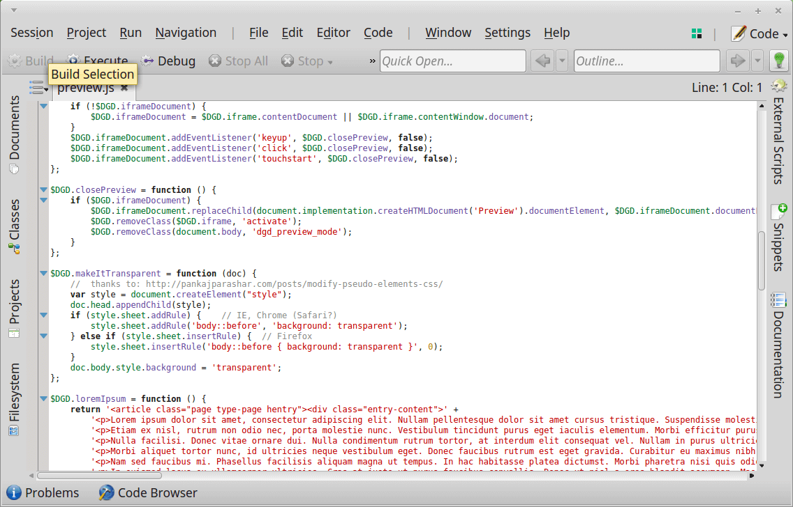

### 5.12 Geany IDE

Geany [主页](http://www.geany.org/)

Geany 是一个免费的、快速的、轻量级跨平台 IDE，只需要很少的依赖包就可以工作，独立于流行的 Linux 桌面环境下，比如 GNOME 和 KDE。它需要 GTK2 库实现功能。

它的特性包括以下列出的内容：

* 支持语法高亮显示
* 代码折叠
* 调用提示
* 符号名自动补完
* 符号列表
* 代码导航
* 一个简单的项目管理工具
* 可以编译并运行用户代码的内置系统
* 可以通过插件扩展

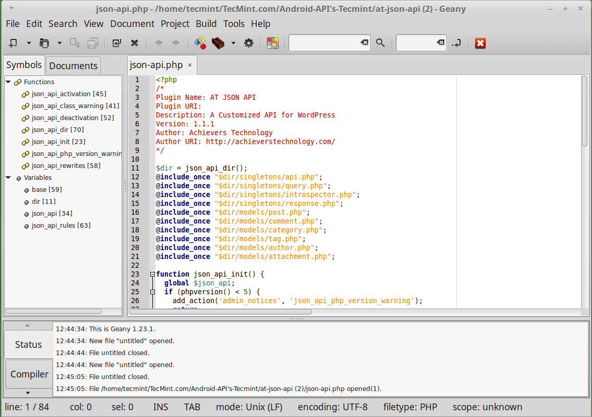

### 5.13 Ajunta DeveStudio

Ajunta DeveStudio [主页](http://anjuta.org/)

Ajunta DevStudio 是一个简单，强大的 GNOME 界面的软件开发工作室，支持包括 C/C++ 在内的几种编程语言。

它提供了先进的编程工具，比如项目管理、GUI 设计、交互式调试器、应用程序向导、源代码编辑器、版本控制等。此外，除了以上特点，Ajunta DeveStudio 也有其他很多不错的 IDE 功能，包括：

* 简单的用户界面
* 可通过插件扩展
* 整合了 Glade 用于所见即所得的 UI 开发
* 项目向导和模板
* 整合了 GDB 调试器
* 内置文件管理器
* 使用 DevHelp 提供上下文敏感的编程辅助
* 源代码编辑器支持语法高亮显示、智能缩进、自动缩进、代码折叠/隐藏、文本缩放等

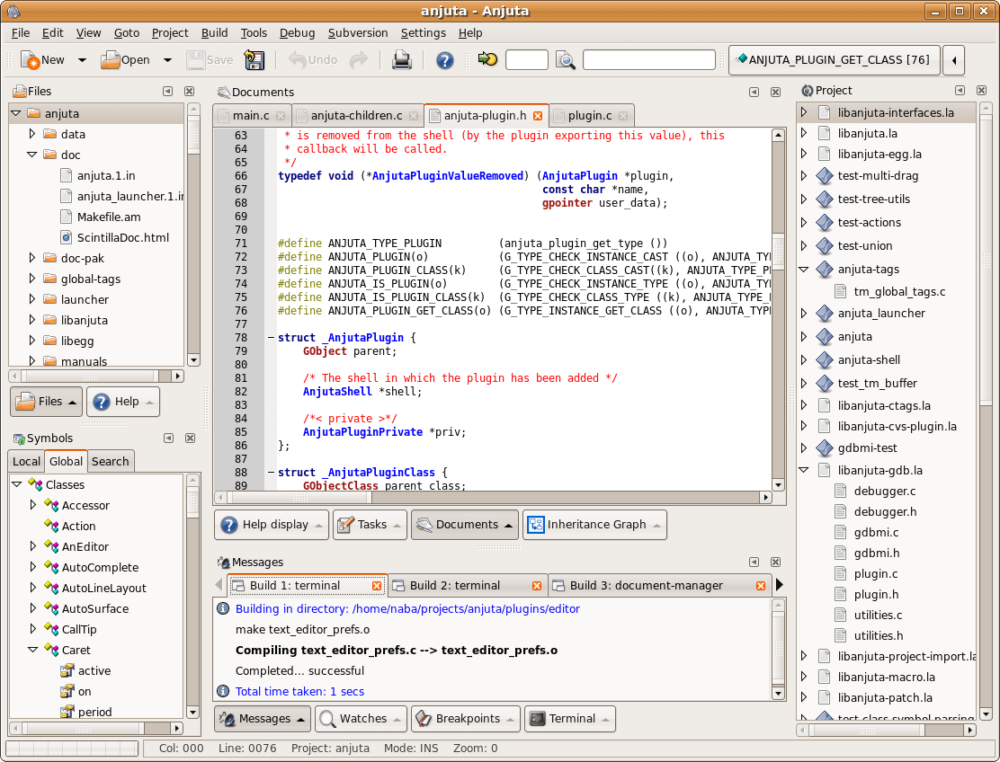

### 5.14 GNAT Programming Studio

GNAT Programming Studio [主页](http://libre.adacore.com/tools/gps/)

GNAT Programming Studio 是一个免费的、易于使用的 IDE，设计的目的用于统一开发人员与他/她的代码和软件之间的交互。

它通过高亮程序的重要部分和逻辑从而提升源代码导航体验，打造了一个理想的编程环境。它的设计目标是为你带来更舒适的编程体验，使用户能够从头开始开发全面的系统。

它丰富的特性包括以下这些：

* 直观的用户界面
* 对开发者的友好性
* 支持多种编程语言，跨平台
* 灵活的 MDI（多文档界面）
* 高度可定制
* 使用喜欢的工具获得全面的可扩展性

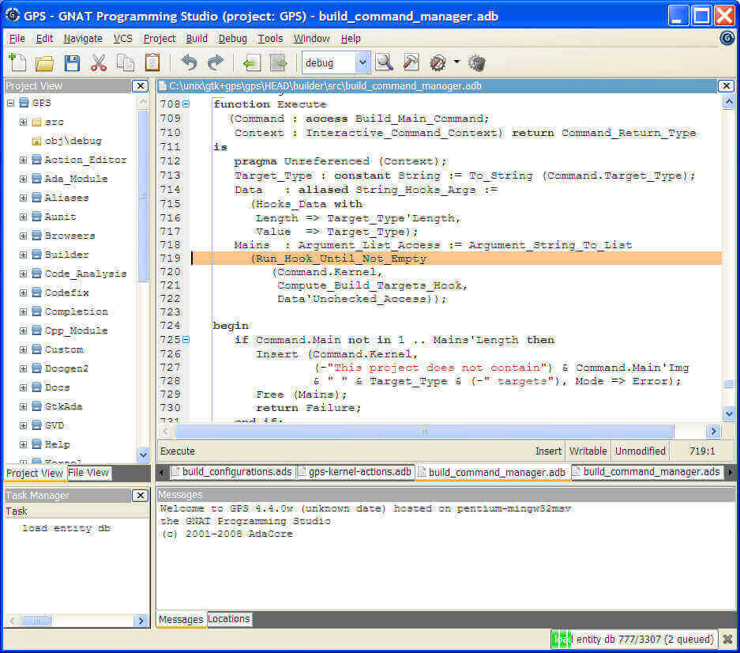

### 5.15 Qt Creator

Qt Creator [主页](https://www.qt.io/ide/)

这是一款收费的、跨平台的 IDE，用于创建连接设备、用户界面和应用程序。Qt Creator 可以让用户比应用的编码做到更多的创新。

它可以用来创建移动和桌面应用程序，也可以连接到嵌入式设备。

它的优点包含以下几点：

* 复杂的代码编辑器
* 支持版本控制
* 项目和构建管理工具
* 支持多屏幕和多平台，易于构建目标之间的切换等等

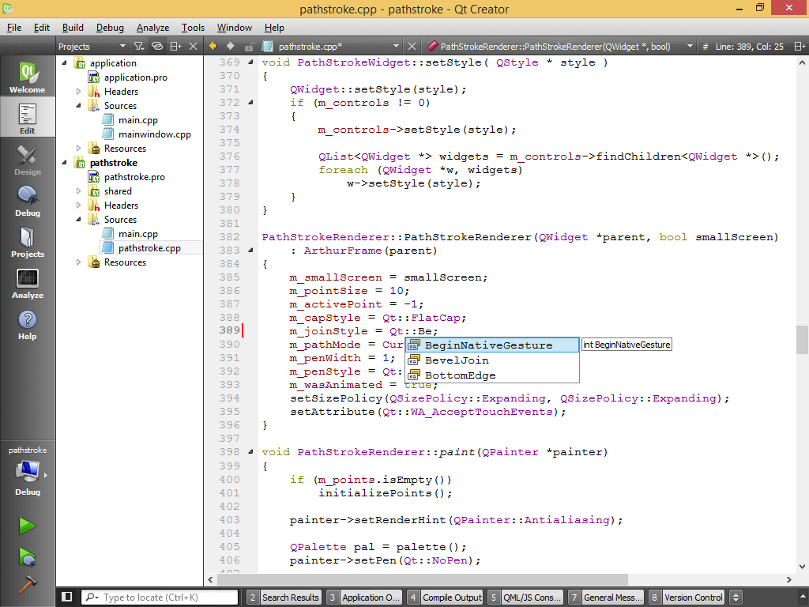

### 5.16 Emacs 编辑器

Emacs [主页](https://www.gnu.org/software/emacs/)

Emacs 是一个自由的、强大的、可高度扩展的、可定制的、跨平台文本编辑器，你可以在 Linux、Solaris、FreeBSD、NetBSD、OpenBSD、Windows 和 Mac OS X 这些系统中使用该编辑器。

Emacs 的核心也是一个 Emacs Lisp 的解释器，Emacs Lisp 是一种基于 Lisp 的编程语言。在撰写本文时，GNU Emacs 的最新版本是 24.5，Emacs 的基本功能包括：

* 内容识别编辑模式
* Unicode 的完全支持
* 可使用 GUI 或 Emacs Lisp 代码高度定制
* 下载和安装扩展的打包系统
* 超出了正常文本编辑的功能生态系统，包括项目策划、邮件、日历和新闻阅读器等
* 完整的内置文档，以及用户指南等等

### 5.17 VI/VIM 编辑器

Vim，一款 VI 编辑器的改进版本，是一款自由的、强大的、流行的并且高度可配置的文本编辑器。它为有效率地文本编辑而生，并且为 Unix/Linux 使用者提供了激动人心的编辑器特性，因此，它对于撰写和编辑 C/C++ 代码也是一个好的选择。
